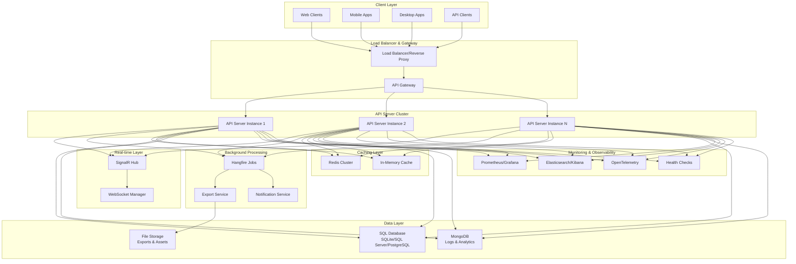
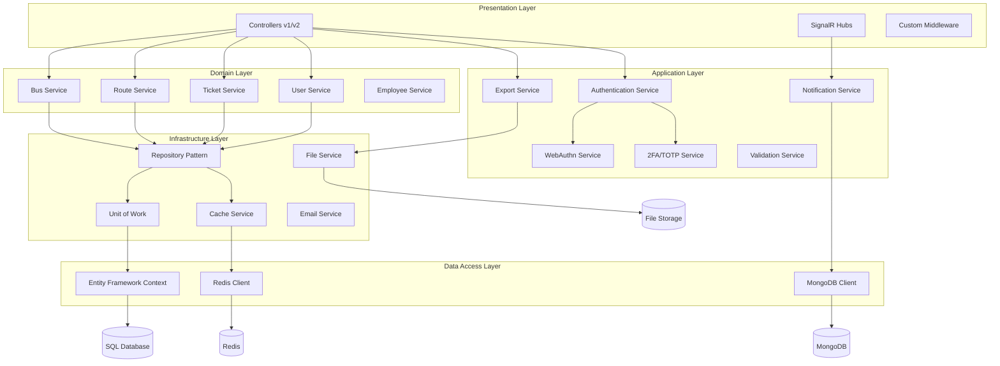

# Design Document: API Server Modernization

## Overview

This design document outlines the modernization of the existing TicketSalesApp.AdminServer (.NET 9.0 ASP.NET Core Web API) to support WebSockets, bulk data operations, enhanced interoperability, improved security and performance, and flexible database support. The design maintains 100% backward compatibility while adding modern capabilities.

## Architecture

### High-Level Architecture



### Modernized Application Architecture



## Components and Interfaces

### 1. Enhanced Authentication System

#### WebAuthn Integration
```csharp
public interface IWebAuthnService
{
    Task<CredentialCreateOptions> BeginRegistrationAsync(string username);
    Task<bool> CompleteRegistrationAsync(string username, AuthenticatorAttestationRawResponse response);
    Task<AssertionOptions> BeginLoginAsync(string username);
    Task<SignInResult> CompleteLoginAsync(AssertionResponse response);
}

public class WebAuthnService : IWebAuthnService
{
    private readonly IFido2 _fido2;
    private readonly IUserService _userService;
    private readonly IMemoryCache _cache;
    
    // Implementation details...
}
```

#### Two-Factor Authentication (TOTP)
```csharp
public interface ITotpService
{
    Task<TotpSetupResult> GenerateSetupAsync(long userId);
    Task<bool> ValidateCodeAsync(long userId, string code);
    Task<bool> EnableTotpAsync(long userId, string verificationCode);
    Task<bool> DisableTotpAsync(long userId, string verificationCode);
    Task<IEnumerable<string>> GenerateRecoveryCodesAsync(long userId);
}

public class TotpSetupResult
{
    public string SecretKey { get; set; }
    public string QrCodeUri { get; set; }
    public string ManualEntryKey { get; set; }
}
```

#### Refactored Authentication Controllers
```csharp
// Split the large AuthController into focused controllers

[ApiController]
[Route("api/v1/auth")]
public class AuthenticationController : ControllerBase
{
    // Basic login/logout, JWT token operations
    // Clean API endpoints without embedded HTML
}

[ApiController]
[Route("api/v1/auth/windows")]
public class WindowsAuthController : ControllerBase
{
    // Windows authentication, account linking
}

[ApiController]
[Route("api/v1/auth/webauthn")]
public class WebAuthnController : ControllerBase
{
    // WebAuthn registration and authentication
}

[ApiController]
[Route("api/v1/auth/2fa")]
public class TwoFactorController : ControllerBase
{
    // TOTP setup, validation, recovery codes
}

#if DEBUG
[ApiController]
[Route("api/dev/auth")]
public class AuthDevelopmentController : ControllerBase
{
    private readonly IWebHostEnvironment _environment;
    private readonly IViewRenderService _viewRenderer;
    private readonly IUserService _userService;
    private readonly ILogger<AuthDevelopmentController> _logger;
    
    public AuthDevelopmentController(
        IWebHostEnvironment environment, 
        IViewRenderService viewRenderer,
        IUserService userService,
        ILogger<AuthDevelopmentController> logger)
    {
        _environment = environment;
        _viewRenderer = viewRenderer;
        _userService = userService;
        _logger = logger;
    }
    
    [HttpGet("login")]
    [AllowAnonymous]
    public async Task<IActionResult> LoginPage()
    {
        if (!_environment.IsDevelopment())
        {
            return NotFound("Debug endpoints only available in development");
        }
        
        var model = new LoginPageViewModel
        {
            Title = "Development Login",
            ApiBaseUrl = "/api/v1/auth",
            Features = new[] { "QR Code Login", "Token Debug", "Role Testing" },
            ShowQRCode = true,
            ShowDebugInfo = true,
            DebugData = new Dictionary<string, object>
            {
                { "Environment", _environment.EnvironmentName },
                { "ServerTime", DateTime.UtcNow },
                { "ApiVersion", "v1" }
            }
        };
        
        return await _viewRenderer.RenderViewAsync("~/Views/Debug/Login.cshtml", model);
    }
    
    [HttpGet("register")]
    [AllowAnonymous]
    public async Task<IActionResult> RegisterPage()
    {
        if (!_environment.IsDevelopment())
        {
            return NotFound("Debug endpoints only available in development");
        }
        
        var model = new RegisterPageViewModel
        {
            Title = "Development Registration",
            ApiBaseUrl = "/api/v1/auth",
            AvailableRoles = await GetAvailableRolesAsync(),
            RequireAdminToken = false, // Simplified for development
            ValidationRules = new Dictionary<string, object>
            {
                { "MinPasswordLength", 6 },
                { "RequireSpecialChars", false },
                { "AllowedRoles", new[] { "User", "Manager", "Administrator" } }
            }
        };
        
        return await _viewRenderer.RenderViewAsync("~/Views/Debug/Register.cshtml", model);
    }
    
    [HttpGet("test-users")]
    [AllowAnonymous]
    public async Task<IActionResult> GetTestUsers()
    {
        if (!_environment.IsDevelopment())
        {
            return NotFound();
        }
        
        // Return seeded test users for development
        var testUsers = new[]
        {
            new { 
                Login = "admin", 
                Password = "admin", 
                Role = "Administrator",
                Description = "Full system access - seeded admin user"
            },
            new { 
                Login = "guest", 
                Password = "gX9#mP2$kL5", 
                Role = "User",
                Description = "Basic access - seeded guest user"
            },
            new {
                Login = "manager",
                Password = "manager123",
                Role = "Manager", 
                Description = "Management access - example manager user"
            }
        };
        
        return Ok(new
        {
            TestUsers = testUsers,
            Note = "These are development users from DbInitializer",
            Warning = "DO NOT USE IN PRODUCTION",
            LoginEndpoint = "/api/v1/auth/login",
            TokenEndpoint = "/api/v1/auth/refresh"
        });
    }
    
    [HttpGet("qr-demo")]
    [AllowAnonymous]
    public async Task<IActionResult> QRCodeDemo()
    {
        if (!_environment.IsDevelopment())
        {
            return NotFound();
        }
        
        var model = new QRDemoViewModel
        {
            Title = "QR Code Authentication Demo",
            Instructions = new[]
            {
                "1. Scan QR code with mobile app",
                "2. Authenticate on mobile device", 
                "3. Token will be automatically applied to this session",
                "4. Page will refresh with authenticated state"
            },
            RefreshInterval = 5000, // 5 seconds
            QRCodeEndpoint = "/api/dev/auth/qr-generate",
            StatusEndpoint = "/api/dev/auth/qr-status"
        };
        
        return await _viewRenderer.RenderViewAsync("~/Views/Debug/QRDemo.cshtml", model);
    }
    
    [HttpPost("qr-generate")]
    [AllowAnonymous]
    public async Task<IActionResult> GenerateQRCode()
    {
        if (!_environment.IsDevelopment())
        {
            return NotFound();
        }
        
        // Generate a temporary token for QR code authentication
        var qrToken = Guid.NewGuid().ToString();
        var qrData = new
        {
            Token = qrToken,
            Endpoint = $"{Request.Scheme}://{Request.Host}/api/v1/auth/qr-login",
            ExpiresAt = DateTime.UtcNow.AddMinutes(5)
        };
        
        // Store QR token temporarily (in production, use Redis)
        var qrDataJson = JsonSerializer.Serialize(qrData);
        
        // Generate actual QR code using QRCoder library
        var qrGenerator = new QRCodeGenerator();
        var qrCodeData = qrGenerator.CreateQrCode(qrDataJson, QRCodeGenerator.ECCLevel.Q);
        var qrCode = new PngByteQRCode(qrCodeData);
        var qrCodeBytes = qrCode.GetGraphic(20);
        var qrCodeBase64 = Convert.ToBase64String(qrCodeBytes);
        var qrCodeDataUrl = $"data:image/png;base64,{qrCodeBase64}";
        
        return Ok(new
        {
            QRCodeData = qrCodeDataUrl,
            QRCodeText = qrDataJson, // For debugging
            Token = qrToken,
            ExpiresIn = 300, // 5 minutes
            Instructions = "Scan this QR code with your mobile app",
            TestUrl = $"{Request.Scheme}://{Request.Host}/api/dev/auth/qr-test/{qrToken}"
        });
    }
    
    [HttpGet("qr-test/{token}")]
    [AllowAnonymous]
    public async Task<IActionResult> TestQRCode(string token)
    {
        if (!_environment.IsDevelopment())
        {
            return NotFound();
        }
        
        // Simulate QR code authentication for testing
        var testResult = new
        {
            Token = token,
            Status = "Valid",
            Message = "QR code authentication would succeed",
            MockJwtToken = GenerateMockJwtToken("qr-user", "User"),
            Timestamp = DateTime.UtcNow
        };
        
        return Ok(testResult);
    }
    
    // TOTP (2FA) Debug Endpoints
    [HttpPost("totp/setup-debug")]
    [AllowAnonymous]
    public async Task<IActionResult> SetupTotpDebug([FromBody] TotpSetupDebugRequest request)
    {
        if (!_environment.IsDevelopment())
        {
            return NotFound();
        }
        
        // Generate TOTP secret for testing
        var secret = KeyGeneration.GenerateRandomKey(20);
        var secretBase32 = Base32Encoding.ToString(secret);
        
        // Generate QR code for TOTP setup
        var totpUrl = $"otpauth://totp/DebugApp:{request.Username}?secret={secretBase32}&issuer=DebugApp";
        var qrGenerator = new QRCodeGenerator();
        var qrCodeData = qrGenerator.CreateQrCode(totpUrl, QRCodeGenerator.ECCLevel.Q);
        var qrCode = new PngByteQRCode(qrCodeData);
        var qrCodeBytes = qrCode.GetGraphic(20);
        var qrCodeBase64 = Convert.ToBase64String(qrCodeBytes);
        
        return Ok(new
        {
            Secret = secretBase32,
            QRCodeUrl = $"data:image/png;base64,{qrCodeBase64}",
            ManualEntryKey = secretBase32,
            TestCodes = GenerateTestTotpCodes(secret),
            Instructions = new[]
            {
                "1. Scan QR code with authenticator app (Google Authenticator, Authy, etc.)",
                "2. Or manually enter the secret key",
                "3. Use generated test codes to verify setup",
                "4. Test with /api/dev/auth/totp/verify endpoint"
            }
        });
    }
    
    [HttpPost("totp/verify")]
    [AllowAnonymous]
    public async Task<IActionResult> VerifyTotpDebug([FromBody] TotpVerifyRequest request)
    {
        if (!_environment.IsDevelopment())
        {
            return NotFound();
        }
        
        try
        {
            var secretBytes = Base32Encoding.ToBytes(request.Secret);
            var totp = new Totp(secretBytes);
            var isValid = totp.VerifyTotp(request.Code, out long timeStepMatched, VerificationWindow.RfcSpecifiedNetworkDelay);
            
            return Ok(new
            {
                IsValid = isValid,
                Code = request.Code,
                TimeStepMatched = timeStepMatched,
                CurrentTimeStep = totp.ComputeTotp(),
                RemainingSeconds = 30 - (DateTime.UtcNow.Second % 30),
                DebugInfo = new
                {
                    Secret = request.Secret,
                    Timestamp = DateTime.UtcNow,
                    UnixTime = DateTimeOffset.UtcNow.ToUnixTimeSeconds()
                }
            });
        }
        catch (Exception ex)
        {
            return BadRequest(new { Error = ex.Message, Secret = request.Secret });
        }
    }
    
    // WebAuthn Debug Endpoints
    [HttpPost("webauthn/register-debug")]
    [AllowAnonymous]
    public async Task<IActionResult> WebAuthnRegisterDebug([FromBody] WebAuthnRegisterDebugRequest request)
    {
        if (!_environment.IsDevelopment())
        {
            return NotFound();
        }
        
        // Generate WebAuthn registration options for testing
        var user = new Fido2User
        {
            DisplayName = request.DisplayName,
            Name = request.Username,
            Id = Encoding.UTF8.GetBytes(request.Username)
        };
        
        var options = _fido2.RequestNewCredential(user, new List<PublicKeyCredentialDescriptor>());
        
        return Ok(new
        {
            Options = options,
            DebugInfo = new
            {
                Username = request.Username,
                DisplayName = request.DisplayName,
                Challenge = Convert.ToBase64String(options.Challenge),
                Timeout = options.Timeout,
                Instructions = new[]
                {
                    "1. Use browser's WebAuthn API to create credential",
                    "2. Or use WebAuthn testing tools",
                    "3. Complete registration with /api/dev/auth/webauthn/complete-register",
                    "4. Test authentication with /api/dev/auth/webauthn/authenticate"
                }
            }
        });
    }
    
    [HttpPost("webauthn/complete-register")]
    [AllowAnonymous]
    public async Task<IActionResult> WebAuthnCompleteRegisterDebug([FromBody] AuthenticatorAttestationRawResponse response)
    {
        if (!_environment.IsDevelopment())
        {
            return NotFound();
        }
        
        try
        {
            // Simulate WebAuthn registration completion
            var result = new
            {
                Success = true,
                CredentialId = Convert.ToBase64String(response.Id),
                PublicKey = "mock-public-key-data",
                Counter = response.Response.Counter,
                DebugInfo = new
                {
                    AttestationObject = Convert.ToBase64String(response.Response.AttestationObject),
                    ClientDataJSON = Convert.ToBase64String(response.Response.ClientDataJSON),
                    Timestamp = DateTime.UtcNow
                }
            };
            
            return Ok(result);
        }
        catch (Exception ex)
        {
            return BadRequest(new { Error = ex.Message, Response = response });
        }
    }
    
    // Windows Authentication Debug Endpoints
    [HttpGet("windows/debug-info")]
    [AllowAnonymous]
    public async Task<IActionResult> WindowsAuthDebugInfo()
    {
        if (!_environment.IsDevelopment())
        {
            return NotFound();
        }
        
        var windowsIdentity = HttpContext.User.Identity as WindowsIdentity;
        var debugInfo = new
        {
            IsWindowsAuthentication = HttpContext.User.Identity.AuthenticationType == "Negotiate",
            WindowsIdentity = new
            {
                Name = windowsIdentity?.Name,
                IsAuthenticated = windowsIdentity?.IsAuthenticated ?? false,
                AuthenticationType = windowsIdentity?.AuthenticationType,
                ImpersonationLevel = windowsIdentity?.ImpersonationLevel.ToString(),
                IsAnonymous = windowsIdentity?.IsAnonymous ?? true,
                IsGuest = windowsIdentity?.IsGuest ?? false,
                IsSystem = windowsIdentity?.IsSystem ?? false,
                Token = windowsIdentity?.Token.ToString()
            },
            HttpContext = new
            {
                AuthenticationType = HttpContext.User.Identity.AuthenticationType,
                IsAuthenticated = HttpContext.User.Identity.IsAuthenticated,
                Name = HttpContext.User.Identity.Name,
                Claims = HttpContext.User.Claims.Select(c => new { c.Type, c.Value }).ToArray()
            },
            Environment = new
            {
                MachineName = Environment.MachineName,
                UserDomainName = Environment.UserDomainName,
                UserName = Environment.UserName,
                IsInDomain = !string.IsNullOrEmpty(Environment.UserDomainName)
            },
            TestInstructions = new[]
            {
                "1. Enable Windows Authentication in IIS/IIS Express",
                "2. Disable Anonymous Authentication",
                "3. Access endpoint with domain credentials",
                "4. Check Windows identity information above",
                "5. Test account linking with /api/dev/auth/windows/test-linking"
            }
        };
        
        return Ok(debugInfo);
    }
    
    [HttpPost("windows/test-linking")]
    [AllowAnonymous]
    public async Task<IActionResult> TestWindowsAccountLinking([FromBody] WindowsLinkingTestRequest request)
    {
        if (!_environment.IsDevelopment())
        {
            return NotFound();
        }
        
        var windowsIdentity = HttpContext.User.Identity as WindowsIdentity;
        var linkingResult = new
        {
            WindowsIdentity = windowsIdentity?.Name ?? "Not authenticated with Windows",
            RegularAccount = request.Username,
            LinkingToken = Guid.NewGuid().ToString(),
            LinkingStatus = "Simulated - would create account link",
            Steps = new[]
            {
                "1. Windows user authenticated",
                "2. Regular account credentials verified", 
                "3. Link created between accounts",
                "4. Future logins can use either method"
            },
            TestResult = new
            {
                CanLinkAccounts = !string.IsNullOrEmpty(windowsIdentity?.Name) && !string.IsNullOrEmpty(request.Username),
                WindowsAuth = !string.IsNullOrEmpty(windowsIdentity?.Name),
                RegularAuth = !string.IsNullOrEmpty(request.Username)
            }
        };
        
        return Ok(linkingResult);
    }
    
    // Comprehensive Authentication Testing
    [HttpPost("test-all-auth-methods")]
    [AllowAnonymous]
    public async Task<IActionResult> TestAllAuthenticationMethods([FromBody] ComprehensiveAuthTestRequest request)
    {
        if (!_environment.IsDevelopment())
        {
            return NotFound();
        }
        
        var results = new Dictionary<string, object>();
        
        // Test JWT Authentication
        if (request.TestJWT)
        {
            results["JWT"] = await TestJwtAuthenticationDebug(request.JwtCredentials);
        }
        
        // Test Windows Authentication
        if (request.TestWindows)
        {
            results["Windows"] = TestWindowsAuthenticationDebug();
        }
        
        // Test TOTP
        if (request.TestTOTP && !string.IsNullOrEmpty(request.TotpSecret))
        {
            results["TOTP"] = TestTotpAuthenticationDebug(request.TotpSecret, request.TotpCode);
        }
        
        // Test WebAuthn
        if (request.TestWebAuthn)
        {
            results["WebAuthn"] = TestWebAuthnAuthenticationDebug();
        }
        
        // Test QR Code
        if (request.TestQRCode)
        {
            results["QRCode"] = await TestQRCodeAuthenticationDebug();
        }
        
        var summary = new
        {
            TotalTests = results.Count,
            PassedTests = results.Values.Count(r => ((dynamic)r).Success == true),
            TestResults = results,
            Timestamp = DateTime.UtcNow,
            Instructions = "Use individual debug endpoints for detailed testing of each authentication method"
        };
        
        return Ok(summary);
    }
    
    // Helper methods for comprehensive testing
    private async Task<object> TestJwtAuthenticationDebug(object credentials)
    {
        return new { Success = true, Method = "JWT", Message = "JWT authentication simulation successful" };
    }
    
    private object TestWindowsAuthenticationDebug()
    {
        var windowsIdentity = HttpContext.User.Identity as WindowsIdentity;
        return new 
        { 
            Success = windowsIdentity?.IsAuthenticated ?? false, 
            Method = "Windows", 
            Identity = windowsIdentity?.Name ?? "Not authenticated" 
        };
    }
    
    private object TestTotpAuthenticationDebug(string secret, string code)
    {
        try
        {
            var secretBytes = Base32Encoding.ToBytes(secret);
            var totp = new Totp(secretBytes);
            var isValid = totp.VerifyTotp(code, out long timeStepMatched);
            return new { Success = isValid, Method = "TOTP", Code = code, TimeStep = timeStepMatched };
        }
        catch (Exception ex)
        {
            return new { Success = false, Method = "TOTP", Error = ex.Message };
        }
    }
    
    private object TestWebAuthnAuthenticationDebug()
    {
        return new { Success = true, Method = "WebAuthn", Message = "WebAuthn simulation - requires actual credential" };
    }
    
    private async Task<object> TestQRCodeAuthenticationDebug()
    {
        var qrToken = Guid.NewGuid().ToString();
        return new { Success = true, Method = "QRCode", Token = qrToken, Message = "QR code generated successfully" };
    }
    
    private string GenerateMockJwtToken(string username, string role)
    {
        return $"mock.jwt.token.{username}.{role}.{DateTime.UtcNow.Ticks}";
    }
    
    private object[] GenerateTestTotpCodes(byte[] secret)
    {
        var totp = new Totp(secret);
        var codes = new List<object>();
        
        // Generate codes for current and next few time steps
        for (int i = 0; i < 3; i++)
        {
            var timeStep = DateTimeOffset.UtcNow.AddSeconds(i * 30);
            var code = totp.ComputeTotp(timeStep.DateTime);
            codes.Add(new
            {
                Code = code,
                ValidFrom = timeStep.ToString("HH:mm:ss"),
                ValidUntil = timeStep.AddSeconds(30).ToString("HH:mm:ss"),
                TimeStep = i
            });
        }
        
        return codes.ToArray();
    }
    
    [HttpGet("token-info")]
    [Authorize]
    public async Task<IActionResult> GetTokenInfo()
    {
        if (!_environment.IsDevelopment())
        {
            return NotFound();
        }
        
        var claims = User.Claims.Select(c => new { c.Type, c.Value }).ToArray();
        var userId = User.FindFirst(ClaimTypes.NameIdentifier)?.Value;
        
        var tokenInfo = new
        {
            UserId = userId,
            Claims = claims,
            IsAuthenticated = User.Identity?.IsAuthenticated ?? false,
            AuthenticationType = User.Identity?.AuthenticationType,
            Roles = User.Claims.Where(c => c.Type == ClaimTypes.Role).Select(c => c.Value).ToArray(),
            TokenExpiry = User.FindFirst("exp")?.Value,
            IssuedAt = User.FindFirst("iat")?.Value
        };
        
        return Ok(tokenInfo);
    }
    
    [HttpPost("simulate-error")]
    [AllowAnonymous]
    public IActionResult SimulateError([FromBody] ErrorSimulationRequest request)
    {
        if (!_environment.IsDevelopment())
        {
            return NotFound();
        }
        
        return request.ErrorType switch
        {
            "validation" => BadRequest(new { Error = "Simulated validation error", Field = "username" }),
            "unauthorized" => Unauthorized(new { Error = "Simulated unauthorized access" }),
            "forbidden" => Forbid("Simulated forbidden access"),
            "notfound" => NotFound(new { Error = "Simulated resource not found" }),
            "server" => throw new InvalidOperationException("Simulated server error"),
            _ => Ok(new { Message = "No error simulated" })
        };
    }
    
    // Authentication & Authorization Testing
    [HttpPost("test-auth-flow")]
    [AllowAnonymous]
    public async Task<IActionResult> TestAuthenticationFlow([FromBody] AuthTestRequest request)
    {
        var results = new List<AuthTestResult>();
        
        // Test different authentication methods
        foreach (var method in request.AuthMethods)
        {
            var result = method switch
            {
                "jwt" => await TestJwtAuthentication(request.Credentials),
                "windows" => await TestWindowsAuthentication(request.WindowsIdentity),
                "webauthn" => await TestWebAuthnAuthentication(request.WebAuthnCredential),
                "totp" => await TestTotpAuthentication(request.TotpCode),
                _ => new AuthTestResult { Method = method, Success = false, Error = "Unknown method" }
            };
            results.Add(result);
        }
        
        return Ok(new { TestResults = results, Summary = GenerateAuthTestSummary(results) });
    }
    
    // Role & Permission Debugging
    [HttpGet("user/{userId}/permissions")]
    [AllowAnonymous]
    public async Task<IActionResult> GetUserPermissionsDebug(long userId)
    {
        var user = await _userService.GetUserWithRolesAsync(userId);
        if (user == null) return NotFound();
        
        var debugInfo = new
        {
            UserId = userId,
            LegacyRole = user.Role, // 0=User, 1=Admin, 2=Manager
            LegacyRoleName = user.Role switch { 0 => "User", 1 => "Administrator", 2 => "Manager", _ => "Unknown" },
            ModernRoles = user.UserRoles.Select(ur => new
            {
                RoleId = ur.Role.RoleId,
                RoleName = ur.Role.Name,
                Priority = ur.Role.Priority,
                AssignedAt = ur.AssignedAt,
                AssignedBy = ur.AssignedBy
            }).ToArray(),
            AllPermissions = await GetUserPermissionsAsync(userId),
            PermissionsByCategory = await GetUserPermissionsByCategoryAsync(userId),
            PolicyEvaluations = await TestUserPoliciesAsync(userId),
            RoleHierarchy = GetRoleHierarchyForUser(user)
        };
        
        return Ok(debugInfo);
    }
    
    // Database State Inspection
    [HttpGet("database/state")]
    [AllowAnonymous]
    public async Task<IActionResult> GetDatabaseState()
    {
        var state = new
        {
            ConnectionString = _context.Database.GetConnectionString(),
            DatabaseProvider = _context.Database.ProviderName,
            PendingMigrations = await _context.Database.GetPendingMigrationsAsync(),
            AppliedMigrations = await _context.Database.GetAppliedMigrationsAsync(),
            CanConnect = await _context.Database.CanConnectAsync(),
            
            // Entity counts for debugging
            EntityCounts = new
            {
                Users = await _context.Users.CountAsync(),
                Buses = await _context.Avtobuses.CountAsync(),
                Routes = await _context.Marshuts.CountAsync(),
                Tickets = await _context.Bilets.CountAsync(),
                Roles = await _context.Roles.CountAsync(),
                Permissions = await _context.Permissions.CountAsync(),
                UserRoles = await _context.UserRoles.CountAsync()
            },
            
            // Seeded data verification
            SeededDataStatus = new
            {
                AdminUserExists = await _context.Users.AnyAsync(u => u.Login == "admin"),
                GuestUserExists = await _context.Users.AnyAsync(u => u.Login == "guest"),
                DefaultRolesExist = await _context.Roles.CountAsync(r => r.IsSystem) >= 3,
                PermissionsSeeded = await _context.Permissions.CountAsync() >= 40
            },
            
            // RBAC system health
            RBACSystemHealth = new
            {
                UsersWithoutRoles = await _context.Users.CountAsync(u => !u.UserRoles.Any()),
                RolesWithoutPermissions = await _context.Roles.CountAsync(r => !r.RolePermissions.Any()),
                OrphanedUserRoles = await _context.UserRoles.CountAsync(ur => ur.User == null || ur.Role == null)
            }
        };
        
        return Ok(state);
    }
    
    private async Task<RoleOption[]> GetAvailableRolesAsync()
    {
        // Return roles from seeded data
        return new[]
        {
            new RoleOption { Value = 0, Name = "User", Description = "Basic system access" },
            new RoleOption { Value = 2, Name = "Manager", Description = "System management access" },
            new RoleOption { Value = 1, Name = "Administrator", Description = "Full system access" }
        };
    }
    
    // Helper methods for testing
    private async Task<AuthTestResult> TestJwtAuthentication(object credentials) => new() { Method = "jwt", Success = true };
    private async Task<AuthTestResult> TestWindowsAuthentication(string identity) => new() { Method = "windows", Success = true };
    private async Task<AuthTestResult> TestWebAuthnAuthentication(object credential) => new() { Method = "webauthn", Success = true };
    private async Task<AuthTestResult> TestTotpAuthentication(string code) => new() { Method = "totp", Success = true };
    private object GenerateAuthTestSummary(List<AuthTestResult> results) => new { TotalTests = results.Count, Passed = results.Count(r => r.Success) };
    private async Task<string[]> GetUserPermissionsAsync(long userId) => new[] { "users.view", "buses.view" };
    private async Task<Dictionary<string, string[]>> GetUserPermissionsByCategoryAsync(long userId) => new() { ["User"] = new[] { "users.view" } };
    private async Task<Dictionary<string, bool>> TestUserPoliciesAsync(long userId) => new() { ["AdminOnly"] = false, ["CanViewReports"] = true };
    private object GetRoleHierarchyForUser(object user) => new { Hierarchy = "User < Manager < Administrator" };
}

public class QRDemoViewModel
{
    public string Title { get; set; }
    public string[] Instructions { get; set; }
    public int RefreshInterval { get; set; }
    public string QRCodeEndpoint { get; set; }
    public string StatusEndpoint { get; set; }
}

public class ErrorSimulationRequest
{
    public string ErrorType { get; set; } // validation, unauthorized, forbidden, notfound, server
}

public class AuthTestRequest
{
    public string[] AuthMethods { get; set; }
    public object Credentials { get; set; }
    public string WindowsIdentity { get; set; }
    public object WebAuthnCredential { get; set; }
    public string TotpCode { get; set; }
}

public class AuthTestResult
{
    public string Method { get; set; }
    public bool Success { get; set; }
    public string Error { get; set; }
}

public class TotpSetupDebugRequest
{
    public string Username { get; set; }
}

public class TotpVerifyRequest
{
    public string Secret { get; set; }
    public string Code { get; set; }
}

public class WebAuthnRegisterDebugRequest
{
    public string Username { get; set; }
    public string DisplayName { get; set; }
}

public class WindowsLinkingTestRequest
{
    public string Username { get; set; }
    public string Password { get; set; }
}

public class ComprehensiveAuthTestRequest
{
    public bool TestJWT { get; set; } = true;
    public bool TestWindows { get; set; } = true;
    public bool TestTOTP { get; set; } = false;
    public bool TestWebAuthn { get; set; } = false;
    public bool TestQRCode { get; set; } = true;
    
    public object JwtCredentials { get; set; }
    public string TotpSecret { get; set; }
    public string TotpCode { get; set; }
}
#endif

// Production controllers remain clean and focused
[ApiController]
[Route("api/v1/auth")]
public class AuthenticationController : ControllerBase
{
    [HttpPost("login")]
    [AllowAnonymous]
    public async Task<IActionResult> Login([FromBody] LoginRequest request)
    {
        // Clean, focused login logic without HTML rendering
        // Uses proper policy-based authorization
    }
    
    [HttpPost("logout")]
    [Authorize]
    public async Task<IActionResult> Logout()
    {
        // Clean logout logic
    }
    
    [HttpPost("refresh")]
    [Authorize]
    public async Task<IActionResult> RefreshToken([FromBody] RefreshTokenRequest request)
    {
        // Token refresh logic
    }
}
```

#### Debug View Separation Strategy
```csharp
// Instead of embedded HTML strings in controllers, use proper MVC views

// Views/Debug/Login.cshtml
@model LoginPageViewModel
<!DOCTYPE html>
<html>
<head>
    <title>@Model.Title</title>
    <link rel="stylesheet" href="~/css/debug.css" />
</head>
<body>
    <div class="debug-container">
        <h2>@Model.Title</h2>
        <form id="loginForm">
            <div class="form-group">
                <label for="login">Login:</label>
                <input type="text" id="login" name="login" required />
            </div>
            <div class="form-group">
                <label for="password">Password:</label>
                <input type="password" id="password" name="password" required />
            </div>
            <button type="submit">Login</button>
        </form>
        
        <!-- QR Code section -->
        <div id="qrSection" style="display: none;">
            <h3>QR Code Login</h3>
            
            <button onclick="refreshQR()">Refresh QR</button>
        </div>
        
        <!-- Debug information -->
        <div id="debugInfo" class="debug-panel">
            <h3>Debug Information</h3>
            <div id="requestInfo"></div>
            <div id="responseInfo"></div>
            <div id="tokenInfo"></div>
        </div>
    </div>
    
    <script src="~/js/debug-auth.js"></script>
</body>
</html>

// wwwroot/js/debug-auth.js - Separate JavaScript file
class DebugAuthManager {
    constructor(apiBaseUrl) {
        this.apiBaseUrl = apiBaseUrl;
        this.authToken = '';
        this.setupEventHandlers();
    }
    
    async login(credentials) {
        try {
            const response = await fetch(`${this.apiBaseUrl}/login`, {
                method: 'POST',
                headers: { 'Content-Type': 'application/json' },
                body: JSON.stringify(credentials)
            });
            
            const data = await response.json();
            this.displayResult(data, response.ok);
            
            if (response.ok) {
                this.authToken = data.token;
                await this.loadQRCode();
            }
        } catch (error) {
            this.displayError(error);
        }
    }
    
    async loadQRCode() {
        // QR code loading logic
    }
    
    displayResult(data, success) {
        // Clean result display logic
    }
    
    setupEventHandlers() {
        // Event handler setup
    }
}

// Initialize when page loads
document.addEventListener('DOMContentLoaded', () => {
    new DebugAuthManager('@Model.ApiBaseUrl');
});
```

#### Clean Architecture Benefits
```csharp
// Before: Messy embedded HTML in controller
[HttpGet("login")]
public ContentResult LoginPage()
{
    var html = @"<!DOCTYPE html><html>...3000+ lines of embedded HTML...";
    return Content(html, "text/html");
}

// After: Clean separation of concerns
[HttpGet("login")]
public async Task<IActionResult> LoginPage()
{
    if (!_environment.IsDevelopment()) return NotFound();
    
    var model = await BuildLoginPageModelAsync();
    return View("~/Views/Debug/Login.cshtml", model);
}

// Benefits:
// 1. Proper MVC separation - HTML in views, logic in controllers
// 2. Maintainable CSS and JavaScript in separate files
// 3. Testable view models and controller logic
// 4. IntelliSense support for HTML/CSS/JS
// 5. Proper debugging and error handling
// 6. Reusable components and layouts
// 7. Clean development vs production separation
```

#### Enhanced Debug Functionality Capabilities

The refactored debug endpoint architecture enables comprehensive debugging and development capabilities:

**Key Debug Capabilities Enabled:**

1. **Comprehensive Authentication Testing**: Test JWT, Windows Auth, WebAuthn, and TOTP flows
2. **Role & Permission Debugging**: Inspect user roles, permissions, and policy evaluations  
3. **API Endpoint Validation**: Test all endpoints with different authentication levels
4. **Database State Inspection**: Monitor entity counts, migrations, and RBAC system health
5. **WebSocket Connection Testing**: Test connections, authentication, broadcasting, and groups
6. **Export System Validation**: Test all export formats and large dataset handling
7. **Performance Monitoring**: Database, cache, API, and WebSocket performance testing
8. **Configuration Validation**: Verify all system configurations and feature flags
9. **Interactive Debug Dashboard**: Centralized testing interface for all debug capabilities
10. **Backward Compatibility Testing**: Ensure existing API contracts remain intact

**Interactive Debug Dashboard:**

The refactored debug endpoints enable a comprehensive debug dashboard accessible at `/api/dev/auth/dashboard`:

```html
<!-- Views/Debug/Dashboard.cshtml -->
<div class="debug-dashboard">
    <div class="dashboard-grid">
        <!-- Authentication Testing Panel -->
        <div class="panel">
            <h3>Authentication Testing</h3>
            <button onclick="testAllAuthMethods()">Test All Auth Methods</button>
            <button onclick="testRolePermissions()">Test Role Permissions</button>
            <div id="authTestResults"></div>
        </div>
        
        <!-- API Endpoint Testing Panel -->
        <div class="panel">
            <h3>API Endpoint Testing</h3>
            <button onclick="testAllEndpoints()">Test All Endpoints</button>
            <button onclick="testBackwardCompatibility()">Test Backward Compatibility</button>
            <div id="endpointTestResults"></div>
        </div>
        
        <!-- WebSocket Testing Panel -->
        <div class="panel">
            <h3>WebSocket Testing</h3>
            <button onclick="testWebSocketConnection()">Test Connection</button>
            <button onclick="testWebSocketBroadcast()">Test Broadcasting</button>
            <div id="websocketTestResults"></div>
        </div>
        
        <!-- Export System Testing Panel -->
        <div class="panel">
            <h3>Export System Testing</h3>
            <button onclick="testExportFormats()">Test All Formats</button>
            <button onclick="testLargeExports()">Test Large Exports</button>
            <div id="exportTestResults"></div>
        </div>
        
        <!-- Database State Panel -->
        <div class="panel">
            <h3>Database State</h3>
            <button onclick="loadDatabaseState()">Refresh Database State</button>
            <div id="databaseState"></div>
        </div>
        
        <!-- Performance Monitoring Panel -->
        <div class="panel">
            <h3>Performance Monitoring</h3>
            <button onclick="runPerformanceTests()">Run Performance Tests</button>
            <div id="performanceResults"></div>
        </div>
    </div>
</div>
```

**Debug JavaScript Module:**

```javascript
// wwwroot/js/debug-auth.js
class DebugAuthManager {
    constructor(apiBaseUrl) {
        this.apiBaseUrl = apiBaseUrl;
        this.authToken = localStorage.getItem('debug_auth_token') || '';
        this.setupEventHandlers();
        this.updateAuthState();
    }
    
    async generateQR() {
        try {
            const response = await fetch('/api/dev/auth/qr-generate', {
                method: 'POST',
                headers: this.getAuthHeaders()
            });
            
            const data = await response.json();
            
            if (response.ok) {
                this.displayQRCode(data);
                this.startQRPolling(data.Token);
            } else {
                this.displayError('Failed to generate QR code');
            }
        } catch (error) {
            this.displayError(`QR generation failed: ${error.message}`);
        }
    }
    
    displayQRCode(qrData) {
        const qrImg = document.getElementById('qrCode');
        const refreshBtn = document.getElementById('refreshQRBtn');
        const qrInfo = document.getElementById('qrInfo');
        
        // Display actual QR code image
        qrImg.src = qrData.QRCodeData;
        qrImg.style.display = 'block';
        refreshBtn.style.display = 'inline-block';
        
        // Show QR code information
        if (qrInfo) {
            qrInfo.innerHTML = `
                <div class="qr-info">
                    <p><strong>Token:</strong> ${qrData.Token}</p>
                    <p><strong>Expires in:</strong> ${qrData.ExpiresIn} seconds</p>
                    <p><strong>Test URL:</strong> <a href="${qrData.TestUrl}" target="_blank">Test QR Authentication</a></p>
                    <details>
                        <summary>QR Code Data</summary>
                        <pre>${qrData.QRCodeText}</pre>
                    </details>
                </div>
            `;
        }
    }
    
    async setupTotpDebug() {
        const username = prompt('Enter username for TOTP setup:') || 'debug-user';
        
        try {
            const response = await fetch('/api/dev/auth/totp/setup-debug', {
                method: 'POST',
                headers: this.getAuthHeaders(),
                body: JSON.stringify({ Username: username })
            });
            
            const data = await response.json();
            
            if (response.ok) {
                this.displayTotpSetup(data);
            } else {
                this.displayError('Failed to setup TOTP');
            }
        } catch (error) {
            this.displayError(`TOTP setup failed: ${error.message}`);
        }
    }
    
    displayTotpSetup(totpData) {
        const panel = document.getElementById('totpSetupPanel') || this.createTotpPanel();
        
        panel.innerHTML = `
            <h4>TOTP Setup</h4>
            <div class="totp-setup">
                <div class="qr-section">
                    <h5>Scan with Authenticator App:</h5>
                    
                </div>
                
                <div class="manual-entry">
                    <h5>Manual Entry:</h5>
                    <p><strong>Secret:</strong> <code>${totpData.Secret}</code></p>
                    <button onclick="navigator.clipboard.writeText('${totpData.Secret}')">Copy Secret</button>
                </div>
                
                <div class="test-codes">
                    <h5>Test Codes (for testing):</h5>
                    ${totpData.TestCodes.map(code => `
                        <div class="test-code">
                            <strong>${code.Code}</strong> 
                            (Valid: ${code.ValidFrom} - ${code.ValidUntil})
                            <button onclick="debugAuth.testTotpCode('${totpData.Secret}', '${code.Code}')">Test</button>
                        </div>
                    `).join('')}
                </div>
                
                <div class="totp-verify">
                    <h5>Verify TOTP Code:</h5>
                    <input type="text" id="totpCodeInput" placeholder="Enter 6-digit code" maxlength="6" />
                    <button onclick="debugAuth.verifyTotpCode('${totpData.Secret}')">Verify</button>
                </div>
                
                <div class="instructions">
                    <h5>Instructions:</h5>
                    <ol>
                        ${totpData.Instructions.map(instruction => `<li>${instruction}</li>`).join('')}
                    </ol>
                </div>
            </div>
        `;
        
        panel.style.display = 'block';
    }
    
    async testTotpCode(secret, code) {
        try {
            const response = await fetch('/api/dev/auth/totp/verify', {
                method: 'POST',
                headers: this.getAuthHeaders(),
                body: JSON.stringify({ Secret: secret, Code: code })
            });
            
            const data = await response.json();
            this.displayTotpResult(data);
        } catch (error) {
            this.displayError(`TOTP verification failed: ${error.message}`);
        }
    }
    
    async verifyTotpCode(secret) {
        const code = document.getElementById('totpCodeInput').value;
        if (!code || code.length !== 6) {
            this.displayError('Please enter a 6-digit TOTP code');
            return;
        }
        
        await this.testTotpCode(secret, code);
    }
    
    displayTotpResult(result) {
        const resultDiv = document.getElementById('totpResult') || this.createTotpResultDiv();
        
        resultDiv.innerHTML = `
            <div class="totp-result ${result.IsValid ? 'success' : 'failure'}">
                <h5>TOTP Verification Result</h5>
                <p><strong>Code:</strong> ${result.Code}</p>
                <p><strong>Valid:</strong> ${result.IsValid ? '✓ Yes' : '✗ No'}</p>
                <p><strong>Current Code:</strong> ${result.CurrentTimeStep}</p>
                <p><strong>Remaining Time:</strong> ${result.RemainingSeconds} seconds</p>
                ${result.TimeStepMatched ? `<p><strong>Time Step Matched:</strong> ${result.TimeStepMatched}</p>` : ''}
            </div>
        `;
        
        resultDiv.style.display = 'block';
    }
    
    async setupWebAuthnDebug() {
        const username = prompt('Enter username for WebAuthn:') || 'debug-user';
        const displayName = prompt('Enter display name:') || 'Debug User';
        
        try {
            const response = await fetch('/api/dev/auth/webauthn/register-debug', {
                method: 'POST',
                headers: this.getAuthHeaders(),
                body: JSON.stringify({ Username: username, DisplayName: displayName })
            });
            
            const data = await response.json();
            
            if (response.ok) {
                this.displayWebAuthnSetup(data);
            } else {
                this.displayError('Failed to setup WebAuthn');
            }
        } catch (error) {
            this.displayError(`WebAuthn setup failed: ${error.message}`);
        }
    }
    
    displayWebAuthnSetup(webauthnData) {
        const panel = document.getElementById('webauthnSetupPanel') || this.createWebAuthnPanel();
        
        panel.innerHTML = `
            <h4>WebAuthn Setup</h4>
            <div class="webauthn-setup">
                <div class="registration-options">
                    <h5>Registration Options:</h5>
                    <pre>${JSON.stringify(webauthnData.Options, null, 2)}</pre>
                </div>
                
                <div class="webauthn-actions">
                    <button onclick="debugAuth.startWebAuthnRegistration()">Start WebAuthn Registration</button>
                    <button onclick="debugAuth.testWebAuthnBrowser()">Test Browser Support</button>
                </div>
                
                <div class="instructions">
                    <h5>Instructions:</h5>
                    <ol>
                        ${webauthnData.DebugInfo.Instructions.map(instruction => `<li>${instruction}</li>`).join('')}
                    </ol>
                </div>
                
                <div class="debug-info">
                    <h5>Debug Information:</h5>
                    <p><strong>Username:</strong> ${webauthnData.DebugInfo.Username}</p>
                    <p><strong>Challenge:</strong> ${webauthnData.DebugInfo.Challenge}</p>
                    <p><strong>Timeout:</strong> ${webauthnData.DebugInfo.Timeout}ms</p>
                </div>
            </div>
        `;
        
        panel.style.display = 'block';
    }
    
    async testWebAuthnBrowser() {
        const support = {
            PublicKeyCredential: typeof PublicKeyCredential !== 'undefined',
            IsUserVerifyingPlatformAuthenticatorAvailable: false,
            ConditionalMediation: false
        };
        
        if (support.PublicKeyCredential) {
            try {
                support.IsUserVerifyingPlatformAuthenticatorAvailable = 
                    await PublicKeyCredential.isUserVerifyingPlatformAuthenticatorAvailable();
            } catch (e) {
                console.warn('Could not check platform authenticator availability:', e);
            }
            
            try {
                support.ConditionalMediation = 
                    await PublicKeyCredential.isConditionalMediationAvailable();
            } catch (e) {
                console.warn('Could not check conditional mediation availability:', e);
            }
        }
        
        this.displayWebAuthnSupport(support);
    }
    
    displayWebAuthnSupport(support) {
        const resultDiv = document.getElementById('webauthnSupport') || this.createWebAuthnSupportDiv();
        
        resultDiv.innerHTML = `
            <div class="webauthn-support">
                <h5>WebAuthn Browser Support</h5>
                <p><strong>PublicKeyCredential API:</strong> ${support.PublicKeyCredential ? '✓ Supported' : '✗ Not Supported'}</p>
                <p><strong>Platform Authenticator:</strong> ${support.IsUserVerifyingPlatformAuthenticatorAvailable ? '✓ Available' : '✗ Not Available'}</p>
                <p><strong>Conditional Mediation:</strong> ${support.ConditionalMediation ? '✓ Supported' : '✗ Not Supported'}</p>
                
                ${!support.PublicKeyCredential ? 
                    '<div class="warning">⚠️ WebAuthn is not supported in this browser. Use Chrome, Firefox, or Edge.</div>' : 
                    '<div class="success">✓ WebAuthn is supported in this browser.</div>'
                }
            </div>
        `;
        
        resultDiv.style.display = 'block';
    }
    
    async testWindowsAuth() {
        try {
            const response = await fetch('/api/dev/auth/windows/debug-info', {
                headers: this.getAuthHeaders()
            });
            
            const data = await response.json();
            this.displayWindowsAuthInfo(data);
        } catch (error) {
            this.displayError(`Windows auth test failed: ${error.message}`);
        }
    }
    
    displayWindowsAuthInfo(windowsData) {
        const panel = document.getElementById('windowsAuthPanel') || this.createWindowsAuthPanel();
        
        panel.innerHTML = `
            <h4>Windows Authentication Debug</h4>
            <div class="windows-auth-info">
                <div class="auth-status">
                    <h5>Authentication Status:</h5>
                    <p><strong>Is Windows Auth:</strong> ${windowsData.IsWindowsAuthentication ? '✓ Yes' : '✗ No'}</p>
                    <p><strong>Is Authenticated:</strong> ${windowsData.WindowsIdentity.IsAuthenticated ? '✓ Yes' : '✗ No'}</p>
                    <p><strong>Identity Name:</strong> ${windowsData.WindowsIdentity.Name || 'Not authenticated'}</p>
                    <p><strong>Auth Type:</strong> ${windowsData.WindowsIdentity.AuthenticationType || 'None'}</p>
                </div>
                
                <div class="environment-info">
                    <h5>Environment Information:</h5>
                    <p><strong>Machine Name:</strong> ${windowsData.Environment.MachineName}</p>
                    <p><strong>Domain:</strong> ${windowsData.Environment.UserDomainName || 'Not in domain'}</p>
                    <p><strong>User:</strong> ${windowsData.Environment.UserName}</p>
                    <p><strong>In Domain:</strong> ${windowsData.Environment.IsInDomain ? '✓ Yes' : '✗ No'}</p>
                </div>
                
                <div class="test-actions">
                    <button onclick="debugAuth.testWindowsLinking()">Test Account Linking</button>
                    <button onclick="location.reload()">Refresh Auth Status</button>
                </div>
                
                <div class="instructions">
                    <h5>Test Instructions:</h5>
                    <ol>
                        ${windowsData.TestInstructions.map(instruction => `<li>${instruction}</li>`).join('')}
                    </ol>
                </div>
                
                <details>
                    <summary>Detailed Debug Information</summary>
                    <pre>${JSON.stringify(windowsData, null, 2)}</pre>
                </details>
            </div>
        `;
        
        panel.style.display = 'block';
    }
    
    async testAllAuthMethods() {
        const request = {
            TestJWT: true,
            TestWindows: true,
            TestTOTP: false, // Requires setup
            TestWebAuthn: false, // Requires setup
            TestQRCode: true,
            JwtCredentials: { login: 'admin', password: 'admin' }
        };
        
        try {
            const response = await fetch('/api/dev/auth/test-all-auth-methods', {
                method: 'POST',
                headers: this.getAuthHeaders(),
                body: JSON.stringify(request)
            });
            
            const data = await response.json();
            this.displayComprehensiveAuthResults(data);
        } catch (error) {
            this.displayError(`Comprehensive auth testing failed: ${error.message}`);
        }
    }
    
    displayComprehensiveAuthResults(results) {
        const panel = document.getElementById('authTestResults');
        
        panel.innerHTML = `
            <h4>Comprehensive Authentication Test Results</h4>
            <div class="test-summary">
                <p><strong>Total Tests:</strong> ${results.TotalTests}</p>
                <p><strong>Passed:</strong> ${results.PassedTests}</p>
                <p><strong>Success Rate:</strong> ${Math.round((results.PassedTests / results.TotalTests) * 100)}%</p>
            </div>
            
            <div class="test-results">
                ${Object.entries(results.TestResults).map(([method, result]) => `
                    <div class="test-result ${result.Success ? 'success' : 'failure'}">
                        <h5>${method} Authentication</h5>
                        <p><strong>Status:</strong> ${result.Success ? '✓ Passed' : '✗ Failed'}</p>
                        <p><strong>Message:</strong> ${result.Message || result.Error || 'No message'}</p>
                        ${result.Identity ? `<p><strong>Identity:</strong> ${result.Identity}</p>` : ''}
                        ${result.Token ? `<p><strong>Token:</strong> ${result.Token.substring(0, 20)}...</p>` : ''}
                    </div>
                `).join('')}
            </div>
            
            <div class="detailed-setup">
                <h5>Setup Individual Authentication Methods:</h5>
                <button onclick="debugAuth.setupTotpDebug()">Setup TOTP</button>
                <button onclick="debugAuth.setupWebAuthnDebug()">Setup WebAuthn</button>
                <button onclick="debugAuth.testWindowsAuth()">Test Windows Auth</button>
                <button onclick="debugAuth.generateQR()">Generate QR Code</button>
            </div>
        `;
        
        panel.style.display = 'block';
    }
    
    // Helper methods to create panels
    createTotpPanel() {
        const panel = document.createElement('div');
        panel.id = 'totpSetupPanel';
        panel.className = 'debug-panel';
        panel.style.display = 'none';
        document.body.appendChild(panel);
        return panel;
    }
    
    createTotpResultDiv() {
        const div = document.createElement('div');
        div.id = 'totpResult';
        div.className = 'debug-result';
        document.body.appendChild(div);
        return div;
    }
    
    createWebAuthnPanel() {
        const panel = document.createElement('div');
        panel.id = 'webauthnSetupPanel';
        panel.className = 'debug-panel';
        panel.style.display = 'none';
        document.body.appendChild(panel);
        return panel;
    }
    
    createWebAuthnSupportDiv() {
        const div = document.createElement('div');
        div.id = 'webauthnSupport';
        div.className = 'debug-result';
        document.body.appendChild(div);
        return div;
    }
    
    createWindowsAuthPanel() {
        const panel = document.createElement('div');
        panel.id = 'windowsAuthPanel';
        panel.className = 'debug-panel';
        panel.style.display = 'none';
        document.body.appendChild(panel);
        return panel;
    }
    
    getAuthHeaders() {
        const headers = { 'Content-Type': 'application/json' };
        if (this.authToken) {
            headers['Authorization'] = `Bearer ${this.authToken}`;
        }
        return headers;
    }
}

// Initialize when page loads
document.addEventListener('DOMContentLoaded', () => {
    window.debugAuth = new DebugAuthManager('/api/v1/auth');
});

// Global functions for button clicks
function testAllAuthMethods() { window.debugAuth.testAllAuthMethods(); }
function setupTotpDebug() { window.debugAuth.setupTotpDebug(); }
function setupWebAuthnDebug() { window.debugAuth.setupWebAuthnDebug(); }
function testWindowsAuth() { window.debugAuth.testWindowsAuth(); }
function generateQR() { window.debugAuth.generateQR(); }
```

**Practical Benefits:**

The refactored debug endpoints transform the current "debugging mess" of embedded HTML into a professional, comprehensive debugging and testing platform that provides:

- **Comprehensive Testing**: Developers can test all system components interactively
- **Real-time Debugging**: Live inspection of authentication, permissions, and system state  
- **Performance Monitoring**: Built-in performance testing and monitoring capabilities
- **Configuration Validation**: Automatic validation of all system configurations
- **Interactive Dashboard**: User-friendly interface for all debug operations
- **Professional Structure**: Follows ASP.NET Core best practices and conventions
- **Maintainable Code**: Proper separation of HTML, CSS, JavaScript, and C# logic
- **Development Experience**: Full IntelliSense support, syntax highlighting, and debugging capabilities
- **Production Safety**: Complete isolation using `#if DEBUG` compiler directives

These enhanced debug capabilities significantly improve the development experience while maintaining production safety.

### 2. WebSocket Integration with SignalR

#### SignalR Hub Implementation
```csharp
[Authorize]
public class NotificationHub : Hub
{
    private readonly IUserService _userService;
    private readonly ILogger<NotificationHub> _logger;
    
    public async Task JoinGroup(string groupName)
    {
        await Groups.AddToGroupAsync(Context.ConnectionId, groupName);
    }
    
    public async Task LeaveGroup(string groupName)
    {
        await Groups.RemoveFromGroupAsync(Context.ConnectionId, groupName);
    }
    
    public override async Task OnConnectedAsync()
    {
        var userId = Context.User?.FindFirst(ClaimTypes.NameIdentifier)?.Value;
        if (userId != null)
        {
            await Groups.AddToGroupAsync(Context.ConnectionId, $"user_{userId}");
        }
        await base.OnConnectedAsync();
    }
}
```

#### Real-time Notification Service
```csharp
public interface INotificationService
{
    Task NotifyUserAsync(long userId, string message, object data = null);
    Task NotifyGroupAsync(string groupName, string message, object data = null);
    Task NotifyAllAsync(string message, object data = null);
    Task NotifyDataChangeAsync<T>(string entityType, string operation, T entity);
}

public class NotificationService : INotificationService
{
    private readonly IHubContext<NotificationHub> _hubContext;
    
    public async Task NotifyDataChangeAsync<T>(string entityType, string operation, T entity)
    {
        var notification = new
        {
            Type = "DataChange",
            EntityType = entityType,
            Operation = operation, // CREATE, UPDATE, DELETE
            Data = entity,
            Timestamp = DateTime.UtcNow
        };
        
        await _hubContext.Clients.All.SendAsync("DataChanged", notification);
    }
}
```

### 3. Bulk Export System

#### Export Service Architecture
```csharp
public interface IExportService
{
    Task<ExportJobResult> StartExportAsync(ExportRequest request);
    Task<ExportStatus> GetExportStatusAsync(Guid jobId);
    Task<Stream> DownloadExportAsync(Guid jobId);
    Task<bool> DeleteExportAsync(Guid jobId);
}

public class ExportRequest
{
    public string EntityType { get; set; } // "buses", "routes", "tickets", etc.
    public ExportFormat Format { get; set; } // CSV, Excel, JSON
    public Dictionary<string, object> Filters { get; set; }
    public List<string> Columns { get; set; }
    public int? MaxRecords { get; set; }
}

public enum ExportFormat
{
    CSV,
    Excel,
    JSON
}

public class ExportJobResult
{
    public Guid JobId { get; set; }
    public string Status { get; set; }
    public DateTime CreatedAt { get; set; }
    public DateTime? CompletedAt { get; set; }
    public string DownloadUrl { get; set; }
    public DateTime ExpiresAt { get; set; }
}
```

#### Background Job Implementation with Hangfire
```csharp
public class ExportBackgroundService
{
    private readonly IExportService _exportService;
    private readonly INotificationService _notificationService;
    
    [Queue("exports")]
    public async Task ProcessExportJob(Guid jobId, ExportRequest request, long userId)
    {
        try
        {
            // Update status to processing
            await UpdateExportStatus(jobId, "Processing", 0);
            
            // Generate export file
            var result = await GenerateExportFile(request, 
                progress => UpdateExportStatus(jobId, "Processing", progress));
            
            // Save file and update status
            await SaveExportFile(jobId, result);
            await UpdateExportStatus(jobId, "Completed", 100);
            
            // Notify user via WebSocket
            await _notificationService.NotifyUserAsync(userId, "ExportCompleted", new { JobId = jobId });
        }
        catch (Exception ex)
        {
            await UpdateExportStatus(jobId, "Failed", 0, ex.Message);
            await _notificationService.NotifyUserAsync(userId, "ExportFailed", new { JobId = jobId, Error = ex.Message });
        }
    }
}
```

### 4. Enhanced Authorization System (Fixing the IsAdmin() Issue)

**Root Cause Analysis:**
The current manual `IsAdmin()` checks were implemented as a workaround because ASP.NET Core's built-in authorization policies failed to work properly with the database-stored role system. The specific issues were:

1. **Database Context Access**: ASP.NET Core policies couldn't access the database context to retrieve user roles from the `UserRoles` and `Roles` tables
2. **Legacy Role System**: The system uses both a legacy `Role` integer field (0=User, 1=Admin) and a modern RBAC system with `UserRoles`, `Roles`, and `Permissions` tables
3. **JWT Token Limitations**: JWT tokens only contained basic user information without role details, requiring database lookups for authorization decisions

**Current Database Schema and Seeded Data:**

The system has a comprehensive RBAC structure with seeded data that demonstrates the dual role system:

```csharp
// Legacy role field (still used by manual IsAdmin() checks)
public class User 
{
    [Obsolete("Use UserRoles collection instead. This property is kept for backward compatibility.")]
    public int Role { get; set; } // 0 - User, 1 - Admin
    
    // Modern RBAC system
    public virtual ICollection<UserRole> UserRoles { get; set; }
}

// Modern RBAC tables with seeded data
public class Roles 
{
    public Guid RoleId { get; set; }
    public int LegacyRoleId { get; set; } // Maps to User.Role for compatibility
    public string Name { get; set; }
    public string Description { get; set; }
    public bool IsSystem { get; set; } // System roles cannot be deleted
    public int Priority { get; set; } // Role hierarchy (100=Admin, 50=Manager, 1=User)
    public virtual ICollection<UserRole> UserRoles { get; set; }
    public virtual ICollection<RolePermission> RolePermissions { get; set; }
}

// Seeded Roles (from DbInitializer.cs):
// 1. Administrator (LegacyRoleId=1, Priority=100) - Full system access
// 2. User (LegacyRoleId=0, Priority=1) - Basic system access  
// 3. Manager (LegacyRoleId=2, Priority=50) - System management access

public class UserRole 
{
    public Guid UserId { get; set; }  // Maps to User.GuidId
    public Guid RoleId { get; set; }
    public DateTime AssignedAt { get; set; }
    public string AssignedBy { get; set; }
    public virtual User User { get; set; }
    public virtual Roles Role { get; set; }
}

// Comprehensive Permission System (40+ permissions seeded)
public class Permission 
{
    public Guid PermissionId { get; set; }
    public string Name { get; set; } // e.g., "users.view", "buses.create", "reports.export"
    public string Description { get; set; }
    public string Category { get; set; } // Groups permissions logically
    public virtual ICollection<RolePermission> RolePermissions { get; set; }
}

// Seeded Permission Categories:
// - User Management: users.view, users.create, users.edit, users.delete
// - Role Management: roles.view, roles.create, roles.edit, roles.delete  
// - Employee Management: employees.view, employees.create, employees.edit, employees.delete
// - Bus Management: buses.view, buses.create, buses.edit, buses.delete
// - Route Management: routes.view, routes.create, routes.edit, routes.delete
// - Ticket Management: tickets.view, tickets.create, tickets.edit, tickets.delete
// - Sales Management: sales.view, sales.create, sales.edit, sales.delete
// - Maintenance Management: maintenance.view, maintenance.create, maintenance.edit, maintenance.delete
// - Reports: reports.view, reports.create, reports.export

// Seeded Users:
// 1. admin (Login="admin", Role=1, Password="admin") - Has Administrator role + all permissions
// 2. guest (Login="guest", Role=0, Password="gX9#mP2$kL5") - Has User role + view-only permissions
```

**Permission Assignment Matrix (from seeded data):**
- **Administrator Role**: ALL permissions (40+ permissions)
- **Manager Role**: View + Create + Edit permissions (no delete permissions)
- **User Role**: View-only permissions across all categories

**Key Integration Points:**
1. **Legacy Compatibility**: `User.Role` field still used by manual `IsAdmin()` checks
2. **Modern RBAC**: `UserRoles` → `Roles` → `RolePermissions` → `Permissions` chain
3. **Dual Mapping**: `Roles.LegacyRoleId` maps modern roles to legacy role numbers
4. **Hierarchical Structure**: Role priorities enable role inheritance (100 > 50 > 1)

**The Proper Solution:**

#### Custom Authorization Handler with Database Access
```csharp
public class DatabaseRoleAuthorizationHandler : AuthorizationHandler<RoleRequirement>
{
    private readonly IServiceScopeFactory _scopeFactory;
    private readonly IMemoryCache _cache;
    
    public DatabaseRoleAuthorizationHandler(IServiceScopeFactory scopeFactory, IMemoryCache cache)
    {
        _scopeFactory = scopeFactory;
        _cache = cache;
    }
    
    protected override async Task HandleRequirementAsync(
        AuthorizationHandlerContext context, 
        RoleRequirement requirement)
    {
        var userIdClaim = context.User.FindFirst(ClaimTypes.NameIdentifier);
        if (userIdClaim == null || !long.TryParse(userIdClaim.Value, out var userId))
        {
            context.Fail();
            return;
        }
        
        // Cache user roles for performance (15-minute cache)
        var cacheKey = $"user_roles_{userId}";
        var userRoles = await _cache.GetOrCreateAsync(cacheKey, async entry =>
        {
            entry.AbsoluteExpirationRelativeToNow = TimeSpan.FromMinutes(15);
            
            using var scope = _scopeFactory.CreateScope();
            var dbContext = scope.ServiceProvider.GetRequiredService<AppDbContext>();
            
            // Query both legacy and modern role systems for compatibility
            var user = await dbContext.Users
                .Include(u => u.UserRoles)
                .ThenInclude(ur => ur.Role)
                .FirstOrDefaultAsync(u => u.UserId == userId);
                
            if (user == null) return new List<string>();
            
            var roles = new List<string>();
            
            // Add legacy role for backward compatibility
            if (user.Role == 1) // Legacy admin check
            {
                roles.Add("Admin");
            }
            else if (user.Role == 0)
            {
                roles.Add("User");
            }
            
            // Add modern RBAC roles
            if (user.UserRoles != null)
            {
                roles.AddRange(user.UserRoles.Select(ur => ur.Role.Name));
            }
            
            return roles.Distinct().ToList();
        });
        
        // Check if user has required role (supports both legacy and modern roles)
        if (userRoles.Contains(requirement.Role) || 
            (requirement.Role == "Admin" && userRoles.Contains("Administrator")))
        {
            context.Succeed(requirement);
        }
        else
        {
            context.Fail();
        }
    }
}

public class RoleRequirement : IAuthorizationRequirement
{
    public string Role { get; }
    
    public RoleRequirement(string role)
    {
        Role = role;
    }
}

// Permission-based authorization handler for fine-grained control
public class PermissionAuthorizationHandler : AuthorizationHandler<PermissionRequirement>
{
    private readonly IServiceScopeFactory _scopeFactory;
    private readonly IMemoryCache _cache;
    
    protected override async Task HandleRequirementAsync(
        AuthorizationHandlerContext context, 
        PermissionRequirement requirement)
    {
        var userIdClaim = context.User.FindFirst(ClaimTypes.NameIdentifier);
        if (userIdClaim == null || !long.TryParse(userIdClaim.Value, out var userId))
        {
            context.Fail();
            return;
        }
        
        var cacheKey = $"user_permissions_{userId}";
        var userPermissions = await _cache.GetOrCreateAsync(cacheKey, async entry =>
        {
            entry.AbsoluteExpirationRelativeToNow = TimeSpan.FromMinutes(15);
            
            using var scope = _scopeFactory.CreateScope();
            var dbContext = scope.ServiceProvider.GetRequiredService<AppDbContext>();
            
            return await dbContext.Users
                .Where(u => u.UserId == userId)
                .SelectMany(u => u.UserRoles)
                .SelectMany(ur => ur.Role.RolePermissions)
                .Select(rp => rp.Permission.Name)
                .Distinct()
                .ToListAsync();
        });
        
        if (userPermissions.Contains(requirement.Permission))
        {
            context.Succeed(requirement);
        }
        else
        {
            context.Fail();
        }
    }
}

public class PermissionRequirement : IAuthorizationRequirement
{
    public string Permission { get; }
    
    public PermissionRequirement(string permission)
    {
        Permission = permission;
    }
}
```

#### Policy Configuration in Startup
```csharp
services.AddAuthorization(options =>
{
    // Role-based policies (supports both legacy and modern roles)
    options.AddPolicy("AdminOnly", policy =>
        policy.Requirements.Add(new RoleRequirement("Admin")));
    
    options.AddPolicy("ModeratorOrAdmin", policy =>
        policy.RequireAssertion(context =>
            context.User.HasClaim("role", "Admin") ||
            context.User.HasClaim("role", "Moderator")));
    
    // Permission-based policies for fine-grained control
    options.AddPolicy("CanManageBuses", policy =>
        policy.Requirements.Add(new PermissionRequirement("buses.manage")));
    
    options.AddPolicy("CanViewReports", policy =>
        policy.Requirements.Add(new PermissionRequirement("reports.view")));
    
    options.AddPolicy("CanExportData", policy =>
        policy.Requirements.Add(new PermissionRequirement("data.export")));
});

// Register authorization handlers
services.AddScoped<IAuthorizationHandler, DatabaseRoleAuthorizationHandler>();
services.AddScoped<IAuthorizationHandler, PermissionAuthorizationHandler>();

// Cache invalidation service for role changes
services.AddScoped<IRoleCache, RoleCacheService>();
```

#### Role Cache Invalidation Service
```csharp
public interface IRoleCache
{
    Task InvalidateUserRolesAsync(long userId);
    Task InvalidateUserPermissionsAsync(long userId);
    Task InvalidateAllUserCachesAsync();
}

public class RoleCacheService : IRoleCache
{
    private readonly IMemoryCache _cache;
    private readonly ILogger<RoleCacheService> _logger;
    
    public RoleCacheService(IMemoryCache cache, ILogger<RoleCacheService> logger)
    {
        _cache = cache;
        _logger = logger;
    }
    
    public Task InvalidateUserRolesAsync(long userId)
    {
        var cacheKey = $"user_roles_{userId}";
        _cache.Remove(cacheKey);
        _logger.LogInformation("Invalidated role cache for user {UserId}", userId);
        return Task.CompletedTask;
    }
    
    public Task InvalidateUserPermissionsAsync(long userId)
    {
        var cacheKey = $"user_permissions_{userId}";
        _cache.Remove(cacheKey);
        _logger.LogInformation("Invalidated permission cache for user {UserId}", userId);
        return Task.CompletedTask;
    }
    
    public Task InvalidateAllUserCachesAsync()
    {
        // Note: IMemoryCache doesn't have a clear all method
        // In production, consider using Redis with pattern-based invalidation
        _logger.LogWarning("Full cache invalidation requested - consider using Redis for production");
        return Task.CompletedTask;
    }
}
```

#### Updated Controller Usage
```csharp
[ApiController]
[Route("api/v1/[controller]")]
public class BusesController : ControllerBase
{
    private readonly IRoleCache _roleCache;
    
    public BusesController(IRoleCache roleCache)
    {
        _roleCache = roleCache;
    }
    
    // No more manual IsAdmin() checks!
    
    [HttpPost]
    [Authorize(Policy = "AdminOnly")] // Uses both legacy Role=1 and modern RBAC
    public async Task<ActionResult<Avtobus>> CreateBus([FromBody] CreateBusModel model)
    {
        // Implementation without manual role checking
        // The authorization handler automatically checks:
        // 1. Legacy User.Role == 1 (Admin)
        // 2. Modern UserRoles containing "Admin" role
    }
    
    [HttpDelete("{id}")]
    [Authorize(Policy = "CanManageBuses")] // Permission-based authorization
    public async Task<IActionResult> DeleteBus(long id)
    {
        // Implementation without manual role checking
        // Uses fine-grained permission system
    }
    
    [HttpPut("{id}")]
    [Authorize(Policy = "AdminOnly")]
    public async Task<IActionResult> UpdateBus(long id, [FromBody] UpdateBusModel model)
    {
        // After updating bus, invalidate relevant caches if needed
        await _roleCache.InvalidateUserRolesAsync(GetCurrentUserId());
        
        // Implementation without manual role checking
    }
}

// Example of the old manual check that will be removed:
/*
[HttpPost]
public async Task<ActionResult<Avtobus>> CreateBus_OLD([FromBody] CreateBusModel model)
{
    // OLD WAY - Manual check that will be removed
    if (!IsAdmin())
    {
        return Forbid("Only administrators can create buses");
    }
    
    // Implementation...
}

private bool IsAdmin()
{
    // This ugly hack will be completely removed
    var userIdClaim = User.FindFirst(ClaimTypes.NameIdentifier);
    if (userIdClaim == null || !long.TryParse(userIdClaim.Value, out var userId))
        return false;
        
    var user = _context.Users.FirstOrDefault(u => u.UserId == userId);
    return user?.Role == 1; // Legacy role check
}
*/
```

#### Migration Strategy for Existing Controllers
```csharp
// Step 1: Identify all controllers with manual IsAdmin() checks
// Current controllers that need updating:
// - BusesController
// - RoutesController  
// - TicketSalesController
// - UsersController
// - EmployeesController
// - JobsController
// - MaintenanceController

// Step 2: Replace manual checks with policy attributes
public class ControllerMigrationService
{
    public async Task MigrateControllerAuthorizationAsync()
    {
        // 1. Scan all controllers for IsAdmin() method calls
        // 2. Replace with appropriate [Authorize(Policy = "...")] attributes
        // 3. Remove IsAdmin() methods from base controllers
        // 4. Update unit tests to use policy-based testing
    }
}
```

### 5. Seeded Data Integration and Role System Enhancement

**Current Seeded Data Structure (from DbInitializer.cs):**

The system includes comprehensive seeded data that demonstrates the full RBAC capabilities:

#### Default Roles and Permissions
```csharp
// Seeded Roles with Legacy Mapping
var roles = new[]
{
    new Roles // Administrator - Full Access
    {
        LegacyRoleId = 1,           // Maps to User.Role = 1 (Admin)
        Name = "Administrator",
        Description = "Full system access",
        Priority = 100,             // Highest priority
        IsSystem = true            // Cannot be deleted
    },
    new Roles // Regular User - View Only
    {
        LegacyRoleId = 0,           // Maps to User.Role = 0 (User)
        Name = "User", 
        Description = "Basic system access",
        Priority = 1,               // Lowest priority
        IsSystem = true
    },
    new Roles // Manager - Intermediate Access
    {
        LegacyRoleId = 2,           // New role not in legacy system
        Name = "Manager",
        Description = "System management access", 
        Priority = 50,              // Medium priority
        IsSystem = true
    }
};

// 40+ Granular Permissions Across Categories:
// User Management: users.view, users.create, users.edit, users.delete
// Bus Management: buses.view, buses.create, buses.edit, buses.delete
// Route Management: routes.view, routes.create, routes.edit, routes.delete
// Ticket Management: tickets.view, tickets.create, tickets.edit, tickets.delete
// Sales Management: sales.view, sales.create, sales.edit, sales.delete
// Maintenance Management: maintenance.view, maintenance.create, maintenance.edit, maintenance.delete
// Reports: reports.view, reports.create, reports.export
// Employee Management: employees.view, employees.create, employees.edit, employees.delete
// Role Management: roles.view, roles.create, roles.edit, roles.delete

// Permission Assignment Matrix:
// Administrator: ALL permissions (40+ permissions)
// Manager: View + Create + Edit permissions (no delete)
// User: View-only permissions across all categories
```

#### Default Users
```csharp
// Seeded Users with Dual Role Assignment
var adminUser = new User
{
    Login = "admin",
    PasswordHash = ComputeHash("admin"),
    Role = 1,                    // Legacy role field
    GuidId = Guid.NewGuid(),     // Modern RBAC identifier
    // Also assigned Administrator role via UserRoles table
};

var guestUser = new User  
{
    Login = "guest",
    PasswordHash = ComputeHash("gX9#mP2$kL5"),
    Role = 0,                    // Legacy role field
    GuidId = Guid.NewGuid(),     // Modern RBAC identifier
    // Also assigned User role via UserRoles table
};
```

#### Enhanced Authorization Handler with Seeded Data Support
```csharp
protected override async Task HandleRequirementAsync(
    AuthorizationHandlerContext context, 
    RoleRequirement requirement)
{
    var userIdClaim = context.User.FindFirst(ClaimTypes.NameIdentifier);
    if (userIdClaim == null || !long.TryParse(userIdClaim.Value, out var userId))
    {
        context.Fail();
        return;
    }
    
    var cacheKey = $"user_roles_{userId}";
    var userRoles = await _cache.GetOrCreateAsync(cacheKey, async entry =>
    {
        entry.AbsoluteExpirationRelativeToNow = TimeSpan.FromMinutes(15);
        
        using var scope = _scopeFactory.CreateScope();
        var dbContext = scope.ServiceProvider.GetRequiredService<AppDbContext>();
        
        var user = await dbContext.Users
            .Include(u => u.UserRoles)
            .ThenInclude(ur => ur.Role)
            .FirstOrDefaultAsync(u => u.UserId == userId);
            
        if (user == null) return new List<string>();
        
        var roles = new List<string>();
        
        // Support legacy role system (for backward compatibility)
        switch (user.Role)
        {
            case 1: roles.Add("Administrator"); break;  // Legacy admin
            case 0: roles.Add("User"); break;           // Legacy user  
            case 2: roles.Add("Manager"); break;        // Extended legacy
        }
        
        // Add modern RBAC roles (may include additional roles)
        if (user.UserRoles != null)
        {
            roles.AddRange(user.UserRoles.Select(ur => ur.Role.Name));
        }
        
        return roles.Distinct().ToList();
    });
    
    // Check role with priority-based hierarchy support
    if (userRoles.Contains(requirement.Role) || 
        HasHigherPriorityRole(userRoles, requirement.Role))
    {
        context.Succeed(requirement);
    }
    else
    {
        context.Fail();
    }
}

private bool HasHigherPriorityRole(List<string> userRoles, string requiredRole)
{
    // Role hierarchy: Administrator (100) > Manager (50) > User (1)
    var rolePriorities = new Dictionary<string, int>
    {
        { "Administrator", 100 },
        { "Manager", 50 },
        { "User", 1 }
    };
    
    var requiredPriority = rolePriorities.GetValueOrDefault(requiredRole, 0);
    return userRoles.Any(role => rolePriorities.GetValueOrDefault(role, 0) > requiredPriority);
}
```

#### Policy Configuration with Seeded Data Context
```csharp
services.AddAuthorization(options =>
{
    // Role-based policies matching seeded roles
    options.AddPolicy("AdminOnly", policy =>
        policy.Requirements.Add(new RoleRequirement("Administrator")));
    
    options.AddPolicy("ManagerOrAdmin", policy =>
        policy.Requirements.Add(new RoleRequirement("Manager")));
    
    // Permission-based policies matching seeded permissions
    options.AddPolicy("CanManageBuses", policy =>
        policy.Requirements.Add(new PermissionRequirement("buses.create")));
    
    options.AddPolicy("CanViewReports", policy =>
        policy.Requirements.Add(new PermissionRequirement("reports.view")));
    
    options.AddPolicy("CanExportData", policy =>
        policy.Requirements.Add(new PermissionRequirement("reports.export")));
        
    // Hierarchical policies (Manager can do User actions)
    options.AddPolicy("UserOrHigher", policy =>
        policy.Requirements.Add(new RoleRequirement("User")));
});
```

### 5. Enhanced Database Architecture

#### Repository Pattern Implementation
```csharp
public interface IRepository<T> where T : class
{
    Task<T> GetByIdAsync(object id);
    Task<IEnumerable<T>> GetAllAsync();
    Task<IEnumerable<T>> FindAsync(Expression<Func<T, bool>> predicate);
    Task<T> AddAsync(T entity);
    Task UpdateAsync(T entity);
    Task DeleteAsync(T entity);
    Task<int> CountAsync(Expression<Func<T, bool>> predicate = null);
}

public interface IUnitOfWork : IDisposable
{
    IRepository<Avtobus> Buses { get; }
    IRepository<Marshut> Routes { get; }
    IRepository<Bilet> Tickets { get; }
    IRepository<User> Users { get; }
    IRepository<Employee> Employees { get; }
    
    Task<int> SaveChangesAsync();
    Task BeginTransactionAsync();
    Task CommitTransactionAsync();
    Task RollbackTransactionAsync();
}
```

#### Multi-Database Support
```csharp
public interface IDatabaseProvider
{
    string ProviderName { get; }
    DbContext CreateContext();
    Task MigrateAsync();
    Task<bool> TestConnectionAsync();
}

public class SqlServerProvider : IDatabaseProvider
{
    public string ProviderName => "SqlServer";
    // Implementation...
}

public class PostgreSqlProvider : IDatabaseProvider
{
    public string ProviderName => "PostgreSQL";
    // Implementation...
}

public class MongoDbProvider : IDatabaseProvider
{
    public string ProviderName => "MongoDB";
    // Implementation for document storage...
}
```

#### Caching Strategy
```csharp
public interface ICacheService
{
    Task<T> GetAsync<T>(string key);
    Task SetAsync<T>(string key, T value, TimeSpan? expiration = null);
    Task RemoveAsync(string key);
    Task RemovePatternAsync(string pattern);
    Task<T> GetOrSetAsync<T>(string key, Func<Task<T>> factory, TimeSpan? expiration = null);
}

public class RedisCacheService : ICacheService
{
    private readonly IDatabase _database;
    private readonly ILogger<RedisCacheService> _logger;
    
    // Redis implementation with fallback to memory cache
}
```

## Data Models

### Enhanced User Model
```csharp
public class User
{
    // Existing properties maintained for backward compatibility
    public long UserId { get; set; }
    public Guid GuidId { get; set; }
    public string Login { get; set; }
    public string PasswordHash { get; set; }
    public int Role { get; set; }
    public string PhoneNumber { get; set; }
    public string Email { get; set; }
    public DateTime CreatedAt { get; set; }
    public DateTime? LastLoginAt { get; set; }
    public bool IsActive { get; set; }
    public string WindowsIdentity { get; set; }
    public bool IsWindowsAuth { get; set; }
    public bool DoesWindowsAccountNeedLinking { get; set; }
    public string LinkedRegularAccountUsername { get; set; }
    public string LinkedAccountToken { get; set; }
    
    // New properties for enhanced security
    public bool TwoFactorEnabled { get; set; }
    public string TotpSecret { get; set; }
    public List<string> RecoveryCodes { get; set; }
    public List<WebAuthnCredential> WebAuthnCredentials { get; set; }
    public DateTime? LastPasswordChange { get; set; }
    public int FailedLoginAttempts { get; set; }
    public DateTime? LockoutEnd { get; set; }
    
    // Navigation properties
    public virtual ICollection<UserRole> UserRoles { get; set; }
}

public class WebAuthnCredential
{
    public Guid Id { get; set; }
    public long UserId { get; set; }
    public string CredentialId { get; set; }
    public string PublicKey { get; set; }
    public string DeviceName { get; set; }
    public DateTime CreatedAt { get; set; }
    public DateTime? LastUsedAt { get; set; }
    public bool IsActive { get; set; }
    
    public virtual User User { get; set; }
}
```

### Export Job Model
```csharp
public class ExportJob
{
    public Guid Id { get; set; }
    public long UserId { get; set; }
    public string EntityType { get; set; }
    public ExportFormat Format { get; set; }
    public string Filters { get; set; } // JSON serialized
    public string Columns { get; set; } // JSON serialized
    public ExportStatus Status { get; set; }
    public int Progress { get; set; }
    public string ErrorMessage { get; set; }
    public string FilePath { get; set; }
    public long? FileSizeBytes { get; set; }
    public DateTime CreatedAt { get; set; }
    public DateTime? CompletedAt { get; set; }
    public DateTime ExpiresAt { get; set; }
    
    public virtual User User { get; set; }
}

public enum ExportStatus
{
    Queued,
    Processing,
    Completed,
    Failed,
    Expired
}
```

## Research and Technology Stack

Based on the existing system analysis, the following technologies will be integrated:

### Existing Technologies (Maintained)
- **.NET 9.0** - Current framework, maintained
- **ASP.NET Core** - Web API framework, enhanced
- **Entity Framework Core** - ORM, extended with new providers
- **Serilog** - Logging, enhanced with structured logging
- **JWT Bearer Authentication** - Maintained for backward compatibility
- **Windows Authentication (Negotiate)** - Maintained
- **Swagger/OpenAPI** - Enhanced with better documentation
- **App.Metrics + Prometheus** - Enhanced with custom metrics

### New Technologies (Added)
- **SignalR** - For WebSocket support and real-time communication
- **Hangfire** - For background job processing (exports, notifications)
- **Redis** - For caching, session state, and SignalR backplane
- **MongoDB** - For document storage (logs, analytics)
- **Fido2.AspNetCore** - For WebAuthn implementation
- **OtpNet** - For TOTP/2FA implementation
- **QRCoder** - For proper QR code generation with actual images
- **FluentValidation** - For enhanced input validation
- **OpenTelemetry** - For distributed tracing
- **ClosedXML** - For Excel export generation
- **CsvHelper** - For CSV export generation

### Development and Deployment
- **Docker** - Containerization (existing Dockerfile enhanced)
- **Docker Compose** - Multi-service development environment
- **Nginx** - Reverse proxy and load balancing
- **Elasticsearch** - Log aggregation and search
- **Grafana** - Metrics visualization and dashboards

## Performance Considerations

### 1. Caching Strategy
- **L1 Cache**: In-memory caching for frequently accessed reference data
- **L2 Cache**: Redis distributed cache for session state and computed results
- **Cache Invalidation**: Event-driven cache invalidation using SignalR
- **Cache Warming**: Background jobs to pre-populate cache with common queries

### 2. Database Optimization
- **Connection Pooling**: Optimized Entity Framework connection pool settings
- **Query Optimization**: Compiled queries for frequently executed operations
- **Read Replicas**: Support for read-only database replicas
- **Indexing Strategy**: Comprehensive database indexing for search operations

### 3. Horizontal Scaling
- **Stateless Design**: All session state moved to Redis
- **Load Balancing**: Support for multiple API server instances
- **SignalR Backplane**: Redis backplane for WebSocket scaling
- **Background Job Distribution**: Hangfire distributed processing

### 4. Asynchronous Processing
- **Async/Await**: All I/O operations use async patterns
- **Background Jobs**: Long-running operations moved to background processing
- **Streaming**: Large data exports use streaming to minimize memory usage
- **Pagination**: All list endpoints support pagination with configurable page sizes

## Security Considerations

### 1. Enhanced Authentication
- **Multi-Factor Authentication**: TOTP-based 2FA with recovery codes
- **WebAuthn Support**: Passwordless authentication using FIDO2
- **Account Lockout**: Progressive lockout for failed login attempts
- **Password Policies**: Configurable password complexity requirements

### 2. Authorization Improvements
- **Policy-Based Authorization**: Replace manual `IsAdmin()` checks with centralized policies
- **Resource-Based Authorization**: Fine-grained permissions for specific resources
- **Role Hierarchy**: Support for role inheritance and delegation
- **Audit Logging**: Comprehensive audit trail for all administrative actions

### 3. Input Validation and Security
- **FluentValidation**: Comprehensive input validation with custom rules
- **SQL Injection Prevention**: Parameterized queries and Entity Framework protection
- **XSS Prevention**: Input sanitization and output encoding
- **CSRF Protection**: Anti-forgery tokens for state-changing operations

### 4. Network Security
- **HTTPS Enforcement**: Strict HTTPS with HSTS headers
- **CORS Configuration**: Restrictive CORS policies for production
- **Rate Limiting**: Per-user and per-endpoint rate limiting
- **IP Whitelisting**: Optional IP-based access restrictions

## Accessibility Considerations

### 1. API Design
- **Consistent Response Format**: Standardized JSON response structure
- **Error Handling**: Descriptive error messages with error codes
- **Pagination**: Consistent pagination across all list endpoints
- **Filtering**: Standardized query parameter format for filtering

### 2. Documentation
- **OpenAPI Specification**: Comprehensive API documentation
- **Code Examples**: Sample requests and responses in multiple languages
- **SDK Generation**: Auto-generated client SDKs for popular languages
- **Interactive Documentation**: Swagger UI with try-it-out functionality

### 3. Monitoring and Observability
- **Health Checks**: Detailed health check endpoints for all dependencies
- **Metrics**: Business and technical metrics for monitoring
- **Distributed Tracing**: Request tracing across service boundaries
- **Log Correlation**: Correlation IDs for tracking requests across components

## Future Enhancements

### 1. Advanced Features
- **GraphQL Support**: Optional GraphQL endpoint for flexible data querying
- **Event Sourcing**: Event-driven architecture for audit and replay capabilities
- **CQRS Pattern**: Command Query Responsibility Segregation for complex operations
- **Microservices**: Potential decomposition into domain-specific microservices

### 2. Integration Capabilities
- **Message Queues**: Integration with RabbitMQ or Azure Service Bus
- **External APIs**: Standardized integration patterns for third-party services
- **Webhook Support**: Outbound webhooks for external system notifications
- **API Gateway**: Integration with enterprise API gateway solutions

### 3. Advanced Analytics
- **Business Intelligence**: Integration with BI tools for advanced reporting
- **Machine Learning**: Predictive analytics for route optimization and demand forecasting
- **Real-time Dashboards**: Live dashboards for operational monitoring
- **Data Warehousing**: ETL processes for historical data analysis

### 4. Mobile and IoT Support
- **Mobile Push Notifications**: Integration with mobile push notification services
- **Offline Synchronization**: Support for offline-first mobile applications
- **IoT Integration**: APIs for bus tracking and sensor data integration
- **Geolocation Services**: GPS tracking and route optimization features

## Correctness Properties

*A property is a characteristic or behavior that should hold true across all valid executions of a system—essentially, a formal statement about what the system should do. Properties serve as the bridge between human-readable specifications and machine-verifiable correctness guarantees.*

### Property 1: WebSocket Authentication Enforcement
*For any* WebSocket connection attempt, only clients with valid JWT tokens should be able to establish connections, and invalid tokens should be rejected with appropriate error messages.
**Validates: Requirements 1.1**

### Property 2: Data Change Broadcasting
*For any* data modification operation (create, update, delete) on buses, routes, tickets, or users, all connected WebSocket clients should receive appropriate change notifications within a reasonable time window.
**Validates: Requirements 1.2**

### Property 3: WebSocket Reconnection Resilience
*For any* WebSocket connection that is dropped, the client reconnection attempts should follow exponential backoff patterns and eventually succeed when the server is available.
**Validates: Requirements 1.3**

### Property 4: Concurrent Connection Management
*For any* number of concurrent WebSocket connections up to the configured limit, the server should handle them efficiently without resource leaks or performance degradation.
**Validates: Requirements 1.4**

### Property 5: Role-Based WebSocket Message Routing
*For any* WebSocket message sent to users, only clients with appropriate roles and permissions should receive the message based on the existing authorization system.
**Validates: Requirements 1.5**

### Property 6: Multi-Format Export Generation
*For any* entity type (buses, routes, tickets, sales), export requests should generate valid files in the requested format (CSV, Excel, JSON) with correct data and structure.
**Validates: Requirements 2.1, 2.2, 2.3**

### Property 7: Streaming Export Memory Efficiency
*For any* export operation with more than 1000 records, memory usage should remain bounded and not grow linearly with dataset size due to streaming implementation.
**Validates: Requirements 2.4**

### Property 8: Export Progress Notification
*For any* export operation in progress, WebSocket progress updates should be sent to the requesting client at regular intervals until completion.
**Validates: Requirements 2.5**

### Property 9: Language-Agnostic API Specification
*For any* API endpoint, the OpenAPI specification should contain sufficient detail (parameters, responses, examples) to enable implementation in any programming language.
**Validates: Requirements 3.7**

### Property 10: WebAuthn Authentication Flow
*For any* WebAuthn registration and authentication attempt, the FIDO2 protocol should be correctly implemented with proper challenge-response validation.
**Validates: Requirements 4.3**

### Property 11: TOTP Code Validation
*For any* TOTP code generated within the valid time window, the system should accept it for authentication, and codes outside the window should be rejected.
**Validates: Requirements 4.4**

### Property 12: Policy-Based Authorization Consistency
*For any* API endpoint requiring authorization, the system should use centralized policy-based authorization instead of manual role checks, ensuring consistent security enforcement.
**Validates: Requirements 4.6**

### Property 13: Cache Consistency and Invalidation
*For any* cached data that is modified, the cache should be invalidated appropriately, and subsequent requests should return the updated data.
**Validates: Requirements 5.1**

### Property 14: Background Job Processing
*For any* long-running operation submitted as a background job, it should be processed asynchronously without blocking the API response, and job status should be trackable.
**Validates: Requirements 5.5**

### Property 15: Database Provider Compatibility
*For any* data operation, the results should be consistent across different supported database providers (SQLite, SQL Server, PostgreSQL) when using the same data.
**Validates: Requirements 6.1**

### Property 16: MongoDB Document Storage
*For any* document stored in MongoDB, it should be retrievable with data integrity maintained, and queries should return consistent results.
**Validates: Requirements 6.3**

### Property 17: Distributed Tracing Propagation
*For any* API request, trace information should be properly propagated through all service layers and recorded for observability.
**Validates: Requirements 8.4**

### Property 18: Backward Compatibility Preservation
*For any* existing API endpoint, the modernized server should maintain identical request/response behavior to ensure existing clients continue to work without modification.
**Validates: Requirements 10.1**

### Property 19: JWT Token Format Compatibility
*For any* JWT token generated by the modernized system, it should be compatible with existing token validation logic and contain the same claims structure.
**Validates: Requirements 10.2**

### Property 20: OpenAPI Specification Completeness
*For any* API endpoint, the OpenAPI specification should include complete documentation with examples, making it suitable as a contract for reimplementation in other languages.
**Validates: Requirements 12.6**

## Error Handling

### 1. Centralized Exception Handling
The system implements a comprehensive error handling strategy that maintains backward compatibility while adding enhanced error reporting:

```csharp
public class GlobalExceptionMiddleware
{
    public async Task InvokeAsync(HttpContext context, RequestDelegate next)
    {
        try
        {
            await next(context);
        }
        catch (Exception ex)
        {
            await HandleExceptionAsync(context, ex);
        }
    }
    
    private async Task HandleExceptionAsync(HttpContext context, Exception exception)
    {
        var response = exception switch
        {
            ValidationException validationEx => CreateValidationErrorResponse(validationEx),
            UnauthorizedAccessException => CreateUnauthorizedResponse(),
            NotFoundException notFoundEx => CreateNotFoundResponse(notFoundEx),
            BusinessRuleException businessEx => CreateBusinessRuleErrorResponse(businessEx),
            _ => CreateInternalServerErrorResponse(exception)
        };
        
        // Log with correlation ID for tracing
        _logger.LogError(exception, "Request {CorrelationId} failed: {Message}", 
            context.TraceIdentifier, exception.Message);
        
        context.Response.StatusCode = response.StatusCode;
        await context.Response.WriteAsync(JsonSerializer.Serialize(response));
    }
}
```

### 2. Structured Error Responses
All error responses follow a consistent format that provides actionable information:

```csharp
public class ApiErrorResponse
{
    public int StatusCode { get; set; }
    public string Message { get; set; }
    public string Detail { get; set; }
    public string CorrelationId { get; set; }
    public DateTime Timestamp { get; set; }
    public Dictionary<string, string[]> ValidationErrors { get; set; }
    public string HelpUrl { get; set; }
}
```

### 3. WebSocket Error Handling
WebSocket connections have specialized error handling for real-time scenarios:

```csharp
public class WebSocketErrorHandler
{
    public async Task HandleConnectionError(string connectionId, Exception exception)
    {
        var errorMessage = new
        {
            Type = "Error",
            Message = GetUserFriendlyMessage(exception),
            Code = GetErrorCode(exception),
            Timestamp = DateTime.UtcNow
        };
        
        await _hubContext.Clients.Client(connectionId)
            .SendAsync("Error", errorMessage);
    }
}
```

### 4. Background Job Error Handling
Background jobs implement retry policies and error notification:

```csharp
[AutomaticRetry(Attempts = 3, DelaysInSeconds = new[] { 60, 300, 900 })]
public async Task ProcessExportWithErrorHandling(ExportRequest request)
{
    try
    {
        await ProcessExport(request);
    }
    catch (Exception ex)
    {
        await _notificationService.NotifyUserAsync(request.UserId, 
            "ExportFailed", new { Error = ex.Message, JobId = request.JobId });
        throw; // Re-throw for Hangfire retry logic
    }
}
```

## Service Layer Architecture

The existing system includes a comprehensive service layer that provides business logic and data access functionality. The refactored authentication controllers will integrate with these existing services while maintaining backward compatibility.

### Existing Authentication Services

#### 1. AuthenticationService (IAuthenticationService)

The `AuthenticationService` provides core authentication functionality including password-based authentication, Windows authentication, and user registration.

**Location**: `TicketSalesApp.Services/Implementations/AuthenticationService.cs`

**Key Features**:
- **Password Authentication**: SHA256-based password hashing and verification
- **Windows Authentication**: Integration with Windows domain authentication and auto-provisioning
- **User Registration**: New user creation with role assignment
- **Direct QR Authentication**: Support for QR code-based authentication flows
- **Account Linking**: Links Windows identities to existing user accounts

**Interface Methods**:
```csharp
public interface IAuthenticationService
{
    Task<User?> AuthenticateAsync(string login, string password);
    Task<bool> RegisterAsync(string login, string password, int role);
    Task<User?> AuthenticateDirectQRAsync(string login, string validationToken);
}
```

**Implementation Details**:
- Uses Entity Framework Core for data access via `AppDbContext`
- Integrates with `IRoleService` for role management
- Supports Windows authentication with configurable auto-provisioning
- Implements secure password hashing using SHA256
- Provides comprehensive logging for authentication events
- Handles both legacy role system (integer-based) and modern RBAC system

**Configuration Dependencies**:
- `WindowsAuthSettings`: Controls Windows authentication behavior
- Database context for user data access
- Role service for role assignment and validation

#### 2. QRAuthenticationService (IQRAuthenticationService)

The `QRAuthenticationService` provides QR code-based authentication functionality using the Russian payment order format for secure QR code generation.

**Location**: `TicketSalesApp.Services/Implementations/QRAuthenticationService.cs`

**Key Features**:
- **QR Code Generation**: Creates secure QR codes using `RussiaPaymentOrder` format
- **Token Validation**: Validates QR login tokens with encryption and expiration
- **Session Management**: Uses in-memory caching for temporary session storage
- **Direct Login Support**: Enables direct QR-based login without password
- **Device Integration**: Supports device-specific QR authentication flows

**Interface Methods**:
```csharp
public interface IQRAuthenticationService
{
    Task<string> GenerateQRLoginTokenAsync(User user);
    Task<(bool success, User? user)> ValidateQRLoginTokenAsync(string token);
    Task<string> GenerateQRCodeAsync(User user);
    Task<(string qrCode, string rawData)> GenerateQRCodeWithDataAsync(User user);
    
    // Direct login methods
    Task<(string qrCode, string rawData)> GenerateDirectLoginQRCodeAsync(string username, string deviceType);
    Task<(bool success, User? user, string deviceId)> ValidateDirectLoginTokenAsync(string token, string deviceType);
    Task<bool> NotifyDeviceLoginSuccessAsync(string deviceId, string token);
}
```

**Implementation Details**:
- Uses `QRCoder` library for PNG-based QR code image generation
- Implements AES encryption for sensitive data in QR codes
- Uses `RussiaPaymentOrder` format for structured QR data encoding
- Provides session management with configurable expiration (5-30 minutes)
- Supports both standard and direct login QR flows
- Includes comprehensive validation and error handling

**Security Features**:
- AES encryption for all sensitive data in QR codes
- Configurable encryption keys via `QRLogin:EncryptionKey` setting
- Time-based token expiration with validation
- Session-based validation codes for additional security
- Device type validation for direct login flows

#### 3. PayloadGenerator.RussiaPaymentOrder

The `RussiaPaymentOrder` class provides structured QR code generation following Russian payment standards, repurposed for secure authentication data encoding.

**Location**: `TicketSalesApp.Services/qrpayload/RussiaPaymentOrder.cs`

**Key Features**:
- **Structured Data Format**: Uses Russian payment order format for data organization
- **Character Set Support**: Supports UTF-8, Windows-1251, and KOI8-R encodings
- **Field Validation**: Comprehensive validation for all data fields
- **Separator Detection**: Automatic separator selection to avoid conflicts
- **Extensible Fields**: Support for both mandatory and optional data fields

**Usage in Authentication**:
The QR authentication service uses this class to encode authentication data:
- `Name`: Encrypted username
- `PersonalAcc`: Encrypted session ID
- `BankName`: Encrypted timestamp
- `BIC`: Encrypted validation code
- `CorrespAcc`: Encrypted role or device type

**Implementation Details**:
```csharp
public class RussiaPaymentOrder : Payload
{
    // Mandatory fields for authentication data
    private readonly MandatoryFields _mFields = new MandatoryFields();
    
    // Optional fields for extended functionality
    private readonly OptionalFields _oFields = new OptionalFields();
    
    // Character encoding support
    private readonly CharacterSets _characterSet;
    
    // Dynamic separator selection
    private string _separator = "|";
}
```

**Security Considerations**:
- All sensitive data is encrypted before encoding
- Automatic separator selection prevents data injection
- Field validation ensures data integrity
- Support for multiple character encodings for international compatibility

### Service Integration with Refactored Controllers

The refactored authentication controllers will integrate with these existing services while maintaining clean separation of concerns:

#### Controller-Service Integration Pattern
```csharp
[ApiController]
[Route("api/v1/auth")]
public class AuthenticationController : ControllerBase
{
    private readonly IAuthenticationService _authService;
    private readonly IQRAuthenticationService _qrAuthService;
    private readonly ILogger<AuthenticationController> _logger;
    
    public AuthenticationController(
        IAuthenticationService authService,
        IQRAuthenticationService qrAuthService,
        ILogger<AuthenticationController> logger)
    {
        _authService = authService;
        _qrAuthService = qrAuthService;
        _logger = logger;
    }
    
    [HttpPost("login")]
    [AllowAnonymous]
    public async Task<IActionResult> Login([FromBody] LoginRequest request)
    {
        // Use existing authentication service
        var user = await _authService.AuthenticateAsync(request.Login, request.Password);
        
        if (user == null)
        {
            return Unauthorized(new { Message = "Invalid credentials" });
        }
        
        // Generate JWT token and return response
        var token = GenerateJwtToken(user);
        return Ok(new { Token = token, User = MapUserResponse(user) });
    }
}

[ApiController]
[Route("api/v1/auth/qr")]
public class QRAuthenticationController : ControllerBase
{
    private readonly IQRAuthenticationService _qrAuthService;
    
    [HttpPost("generate")]
    [Authorize]
    public async Task<IActionResult> GenerateQRCode()
    {
        var user = await GetCurrentUserAsync();
        var (qrCode, rawData) = await _qrAuthService.GenerateQRCodeWithDataAsync(user);
        
        return Ok(new
        {
            QRCode = $"data:image/png;base64,{qrCode}",
            RawData = rawData,
            ExpiresIn = 300 // 5 minutes
        });
    }
    
    [HttpPost("validate")]
    [AllowAnonymous]
    public async Task<IActionResult> ValidateQRToken([FromBody] QRValidationRequest request)
    {
        var (success, user) = await _qrAuthService.ValidateQRLoginTokenAsync(request.Token);
        
        if (!success || user == null)
        {
            return Unauthorized(new { Message = "Invalid or expired QR token" });
        }
        
        var token = GenerateJwtToken(user);
        return Ok(new { Token = token, User = MapUserResponse(user) });
    }
}
```

#### Service Registration and Dependency Injection
```csharp
// Startup.cs - Service registration
public void ConfigureServices(IServiceCollection services)
{
    // Existing service registrations (maintained)
    services.AddScoped<IAuthenticationService, AuthenticationService>();
    services.AddScoped<IQRAuthenticationService, QRAuthenticationService>();
    
    // Enhanced service registrations for modernization
    services.AddScoped<IWebAuthnService, WebAuthnService>();
    services.AddScoped<ITotpService, TotpService>();
    services.AddScoped<INotificationService, NotificationService>();
    services.AddScoped<IExportService, ExportService>();
    
    // Configuration for existing services
    services.Configure<WindowsAuthSettings>(Configuration.GetSection("WindowsAuth"));
    services.AddMemoryCache(); // Required for QR login session management
}
```

#### Error Handling Integration
```csharp
public class AuthenticationServiceException : Exception
{
    public AuthenticationServiceException(string message) : base(message) { }
    public AuthenticationServiceException(string message, Exception innerException) : base(message, innerException) { }
}

// Controller error handling
[HttpPost("login")]
public async Task<IActionResult> Login([FromBody] LoginRequest request)
{
    try
    {
        var user = await _authService.AuthenticateAsync(request.Login, request.Password);
        // ... rest of implementation
    }
    catch (AuthenticationServiceException ex)
    {
        _logger.LogWarning(ex, "Authentication service error for user {Login}", request.Login);
        return BadRequest(new { Message = "Authentication failed", Detail = ex.Message });
    }
    catch (Exception ex)
    {
        _logger.LogError(ex, "Unexpected error during authentication for user {Login}", request.Login);
        return StatusCode(500, new { Message = "Internal server error" });
    }
}
```

### Service Layer Benefits

The existing service layer provides several key benefits for the modernization effort:

1. **Separation of Concerns**: Business logic is properly separated from controller logic
2. **Testability**: Services can be unit tested independently of controllers
3. **Reusability**: Services can be used by multiple controllers or other services
4. **Maintainability**: Changes to business logic are isolated to service implementations
5. **Dependency Injection**: Proper DI patterns enable easy testing and configuration
6. **Logging Integration**: Comprehensive logging throughout the service layer
7. **Configuration Management**: Services use configuration patterns for flexibility

### Future Service Enhancements

The modernization effort will enhance the existing service layer with additional services:

1. **WebAuthnService**: For FIDO2/WebAuthn authentication
2. **TotpService**: For two-factor authentication
3. **NotificationService**: For real-time WebSocket notifications
4. **ExportService**: For bulk data export functionality
5. **CacheService**: For Redis-based caching
6. **AuditService**: For comprehensive audit logging

These new services will follow the same patterns and conventions established by the existing authentication services, ensuring consistency and maintainability across the entire service layer.

## Service and Controller Improvements

The modernization effort includes comprehensive improvements to both existing and new services and controllers, focusing on performance, security, maintainability, and functionality enhancements.

### 1. Enhanced Authentication Services

#### AuthenticationService Improvements

**Current Limitations:**
- Basic SHA256 password hashing (not salted)
- Limited Windows authentication configuration
- No account lockout protection
- No password complexity validation
- Missing audit logging for security events

**Planned Improvements:**
```csharp
public interface IAuthenticationService
{
    // Existing methods (maintained for backward compatibility)
    Task<User?> AuthenticateAsync(string login, string password);
    Task<bool> RegisterAsync(string login, string password, int role);
    Task<User?> AuthenticateDirectQRAsync(string login, string validationToken);
    
    // New enhanced methods
    Task<AuthenticationResult> AuthenticateWithDetailsAsync(string login, string password, string? clientIp = null);
    Task<User?> AuthenticateWindowsUserAsync(string windowsIdentity);
    Task<bool> LinkWindowsIdentityAsync(long userId, string windowsIdentity);
    Task<bool> ValidatePasswordComplexityAsync(string password);
    Task<bool> IsAccountLockedAsync(long userId);
    Task<bool> UnlockAccountAsync(long userId);
    Task<bool> ChangePasswordAsync(long userId, string currentPassword, string newPassword);
    Task<bool> ResetPasswordAsync(long userId, string newPassword, string resetToken);
    Task<IEnumerable<SecurityEvent>> GetUserSecurityEventsAsync(long userId, int limit = 50);
}

public class AuthenticationResult
{
    public bool Success { get; set; }
    public User? User { get; set; }
    public string? FailureReason { get; set; }
    public bool RequiresTwoFactor { get; set; }
    public bool IsAccountLocked { get; set; }
    public int RemainingAttempts { get; set; }
    public DateTime? LockoutEnd { get; set; }
}

public class SecurityEvent
{
    public DateTime Timestamp { get; set; }
    public string EventType { get; set; } // Login, Logout, PasswordChange, AccountLocked, etc.
    public string? ClientIp { get; set; }
    public string? UserAgent { get; set; }
    public bool Success { get; set; }
    public string? Details { get; set; }
}
```

**Implementation Enhancements:**
- **Secure Password Hashing**: Replace SHA256 with bcrypt or Argon2 with proper salting
- **Account Lockout Protection**: Progressive lockout after failed attempts (5, 15, 30 minutes)
- **Password Complexity**: Configurable password policies (length, special chars, etc.)
- **Audit Logging**: Comprehensive security event logging with IP tracking
- **Rate Limiting**: Per-IP and per-user authentication rate limiting
- **Session Management**: Enhanced session tracking and invalidation

#### QRAuthenticationService Improvements

**Current Limitations:**
- Fixed 5-minute expiration for all QR codes
- Basic in-memory caching (not scalable)
- Limited device type support
- No QR code usage analytics

**Planned Improvements:**
```csharp
public interface IQRAuthenticationService
{
    // Existing methods (maintained)
    Task<string> GenerateQRLoginTokenAsync(User user);
    Task<(bool success, User? user)> ValidateQRLoginTokenAsync(string token);
    Task<string> GenerateQRCodeAsync(User user);
    Task<(string qrCode, string rawData)> GenerateQRCodeWithDataAsync(User user);
    Task<(string qrCode, string rawData)> GenerateDirectLoginQRCodeAsync(string username, string deviceType);
    Task<(bool success, User? user, string deviceId)> ValidateDirectLoginTokenAsync(string token, string deviceType);
    Task<bool> NotifyDeviceLoginSuccessAsync(string deviceId, string token);
    
    // New enhanced methods
    Task<QRCodeResult> GenerateQRCodeWithOptionsAsync(User user, QRCodeOptions options);
    Task<bool> RevokeQRTokenAsync(string sessionId);
    Task<IEnumerable<ActiveQRSession>> GetActiveQRSessionsAsync(long userId);
    Task<QRUsageStatistics> GetQRUsageStatisticsAsync(long userId, DateTime? since = null);
    Task<bool> ValidateQRCodeFormatAsync(string qrData);
}

public class QRCodeOptions
{
    public TimeSpan Expiration { get; set; } = TimeSpan.FromMinutes(5);
    public string? DeviceType { get; set; }
    public bool AllowMultipleUse { get; set; } = false;
    public string? Purpose { get; set; } // "login", "verification", "pairing"
    public Dictionary<string, string>? CustomData { get; set; }
}

public class QRCodeResult
{
    public string QRCodeImage { get; set; } // Base64 PNG
    public string RawData { get; set; }
    public string SessionId { get; set; }
    public DateTime ExpiresAt { get; set; }
    public string Purpose { get; set; }
}

public class ActiveQRSession
{
    public string SessionId { get; set; }
    public DateTime CreatedAt { get; set; }
    public DateTime ExpiresAt { get; set; }
    public string Purpose { get; set; }
    public string? DeviceType { get; set; }
    public bool IsUsed { get; set; }
}

public class QRUsageStatistics
{
    public int TotalGenerated { get; set; }
    public int TotalUsed { get; set; }
    public int TotalExpired { get; set; }
    public double SuccessRate { get; set; }
    public Dictionary<string, int> UsageByDevice { get; set; }
    public Dictionary<string, int> UsageByPurpose { get; set; }
}
```

**Implementation Enhancements:**
- **Redis Caching**: Replace in-memory cache with Redis for scalability
- **Configurable Expiration**: Different expiration times based on purpose
- **Usage Analytics**: Track QR code generation and usage patterns
- **Multi-Use QR Codes**: Support for QR codes that can be used multiple times
- **Enhanced Security**: Additional validation and encryption improvements
- **Device Management**: Better device type handling and validation

### 2. New Service Implementations

#### WebAuthn Service (New)
```csharp
public interface IWebAuthnService
{
    Task<CredentialCreateOptions> BeginRegistrationAsync(string username, string? displayName = null);
    Task<CredentialMakeResult> CompleteRegistrationAsync(string username, AuthenticatorAttestationRawResponse response);
    Task<AssertionOptions> BeginLoginAsync(string username);
    Task<AssertionVerificationResult> CompleteLoginAsync(AssertionResponse response);
    Task<IEnumerable<WebAuthnCredential>> GetUserCredentialsAsync(long userId);
    Task<bool> RevokeCredentialAsync(long userId, string credentialId);
    Task<bool> UpdateCredentialNameAsync(long userId, string credentialId, string newName);
}
```

#### TOTP Service (New)
```csharp
public interface ITotpService
{
    Task<TotpSetupResult> GenerateSetupAsync(long userId, string? issuer = null);
    Task<bool> ValidateCodeAsync(long userId, string code);
    Task<bool> EnableTotpAsync(long userId, string verificationCode);
    Task<bool> DisableTotpAsync(long userId, string verificationCode);
    Task<IEnumerable<string>> GenerateRecoveryCodesAsync(long userId);
    Task<bool> UseRecoveryCodeAsync(long userId, string recoveryCode);
    Task<bool> IsTotpEnabledAsync(long userId);
}
```

#### Notification Service (New)
```csharp
public interface INotificationService
{
    Task NotifyUserAsync(long userId, string message, object? data = null);
    Task NotifyGroupAsync(string groupName, string message, object? data = null);
    Task NotifyAllAsync(string message, object? data = null);
    Task NotifyDataChangeAsync<T>(string entityType, string operation, T entity);
    Task NotifyExportProgressAsync(long userId, Guid jobId, int progress, string? message = null);
    Task NotifyExportCompletedAsync(long userId, Guid jobId, string downloadUrl);
    Task NotifySecurityEventAsync(long userId, string eventType, string? details = null);
}
```

### 3. Enhanced Existing Services

#### Enhanced IDataService
```csharp
public interface IDataService
{
    // Existing methods (maintained)
    Task<T> GetAsync<T>(long id) where T : class;
    Task<List<T>> GetAllAsync<T>() where T : class;
    Task<T> AddAsync<T>(T entity) where T : class;
    Task<T> UpdateAsync<T>(T entity) where T : class;
    Task<bool> DeleteAsync<T>(long id) where T : class;
    
    // New enhanced methods
    Task<PagedResult<T>> GetPagedAsync<T>(int page, int pageSize, string? sortBy = null, bool ascending = true) where T : class;
    Task<List<T>> SearchAsync<T>(string searchTerm, string[]? searchFields = null) where T : class;
    Task<List<T>> GetByFilterAsync<T>(Expression<Func<T, bool>> filter) where T : class;
    Task<int> CountAsync<T>(Expression<Func<T, bool>>? filter = null) where T : class;
    Task<bool> ExistsAsync<T>(long id) where T : class;
    Task<List<T>> AddRangeAsync<T>(IEnumerable<T> entities) where T : class;
    Task<bool> DeleteRangeAsync<T>(IEnumerable<long> ids) where T : class;
    Task<T?> GetWithIncludesAsync<T>(long id, params Expression<Func<T, object>>[] includes) where T : class;
}

public class PagedResult<T>
{
    public List<T> Items { get; set; } = new();
    public int TotalCount { get; set; }
    public int Page { get; set; }
    public int PageSize { get; set; }
    public int TotalPages => (int)Math.Ceiling((double)TotalCount / PageSize);
    public bool HasNextPage => Page < TotalPages;
    public bool HasPreviousPage => Page > 1;
}
```

#### Enhanced IExportService
```csharp
public interface IExportService
{
    // Existing methods (maintained)
    Task<byte[]> ExportToExcelAsync<T>(IEnumerable<T> data, string sheetName);
    Task<byte[]> ExportToPdfAsync<T>(IEnumerable<T> data, string title);
    Task<byte[]> ExportToCsvAsync<T>(IEnumerable<T> data);
    Task<string> ExportToJsonAsync<T>(IEnumerable<T> data);
    
    // New enhanced methods
    Task<ExportJobResult> StartExportJobAsync(ExportRequest request);
    Task<ExportStatus> GetExportStatusAsync(Guid jobId);
    Task<Stream> DownloadExportAsync(Guid jobId);
    Task<bool> DeleteExportAsync(Guid jobId);
    Task<IEnumerable<ExportJob>> GetUserExportsAsync(long userId, int limit = 50);
    Task<ExportTemplate> CreateTemplateAsync(string name, ExportConfiguration config);
    Task<IEnumerable<ExportTemplate>> GetTemplatesAsync(long userId);
    Task<byte[]> ExportUsingTemplateAsync(Guid templateId, object parameters);
}

public class ExportRequest
{
    public string EntityType { get; set; } = string.Empty;
    public ExportFormat Format { get; set; }
    public Dictionary<string, object>? Filters { get; set; }
    public List<string>? Columns { get; set; }
    public int? MaxRecords { get; set; }
    public string? TemplateName { get; set; }
    public bool IncludeHeaders { get; set; } = true;
    public string? DateFormat { get; set; }
    public string? NumberFormat { get; set; }
}

public class ExportJobResult
{
    public Guid JobId { get; set; }
    public string Status { get; set; } = "Queued";
    public DateTime CreatedAt { get; set; }
    public DateTime? CompletedAt { get; set; }
    public string? DownloadUrl { get; set; }
    public DateTime ExpiresAt { get; set; }
    public long? FileSizeBytes { get; set; }
    public string? ErrorMessage { get; set; }
}
```

#### Enhanced ITicketSalesService
```csharp
public interface ITicketSalesService
{
    // Existing methods (maintained)
    Task<decimal> GetTotalIncomeAsync(int year, int month);
    Task<List<TransportStatistic>> GetTopTransportsAsync(int year, int month);
    Task<SalesReport>? GetMonthlyReportAsync(int year, int month);
    Task<List<SalesReport>>? GetYearlyReportAsync(int year);
    Task<List<RoutePerformance>>? GetRoutePerformanceAsync(DateTime startDate, DateTime endDate);
    Task<List<TransportUtilization>>? GetTransportUtilizationAsync(DateTime startDate, DateTime endDate);
    Task<byte[]>? ExportToExcelAsync(DateTime startDate, DateTime endDate);
    Task<byte[]>? ExportToPdfAsync(DateTime startDate, DateTime endDate);
    Task<byte[]>? ExportToCsvAsync(DateTime startDate, DateTime endDate);
    
    // New enhanced methods
    Task<SalesAnalytics> GetAdvancedAnalyticsAsync(DateTime startDate, DateTime endDate);
    Task<List<SalesTrend>> GetSalesTrendsAsync(DateTime startDate, DateTime endDate, TrendPeriod period);
    Task<RevenueProjection> GetRevenueProjectionAsync(int months);
    Task<List<CustomerSegment>> GetCustomerSegmentationAsync();
    Task<PerformanceBenchmark> GetPerformanceBenchmarkAsync(DateTime startDate, DateTime endDate);
    Task<List<SeasonalPattern>> GetSeasonalPatternsAsync(int years = 3);
    Task<RealTimeMetrics> GetRealTimeMetricsAsync();
    Task<bool> CreateCustomReportAsync(CustomReportDefinition definition);
    Task<List<CustomReportDefinition>> GetCustomReportsAsync(long userId);
}

public class SalesAnalytics
{
    public decimal TotalRevenue { get; set; }
    public int TotalTickets { get; set; }
    public decimal AverageTicketPrice { get; set; }
    public decimal RevenueGrowth { get; set; }
    public int UniqueCustomers { get; set; }
    public decimal CustomerRetentionRate { get; set; }
    public List<RoutePerformance> TopRoutes { get; set; } = new();
    public List<TimeSlotAnalysis> PeakHours { get; set; } = new();
    public Dictionary<string, decimal> RevenueByCategory { get; set; } = new();
}

public class RealTimeMetrics
{
    public int ActiveBookings { get; set; }
    public decimal TodayRevenue { get; set; }
    public int OnlineUsers { get; set; }
    public List<LiveRouteStatus> LiveRoutes { get; set; } = new();
    public SystemHealth SystemStatus { get; set; } = new();
}
```

### 4. Controller Improvements

#### Enhanced Authentication Controllers

**Current Issues:**
- Large monolithic AuthController with mixed responsibilities
- Embedded HTML in controller methods
- Manual authorization checks instead of policy-based
- Limited error handling and validation
- No API versioning

**Improved Controller Architecture:**
```csharp
// Split into focused controllers with clean separation

[ApiController]
[Route("api/v{version:apiVersion}/auth")]
[ApiVersion("1.0")]
[ApiVersion("2.0")]
public class AuthenticationController : ControllerBase
{
    private readonly IAuthenticationService _authService;
    private readonly INotificationService _notificationService;
    private readonly ILogger<AuthenticationController> _logger;
    
    [HttpPost("login")]
    [AllowAnonymous]
    [MapToApiVersion("1.0")]
    public async Task<IActionResult> LoginV1([FromBody] LoginRequest request)
    {
        // V1 implementation for backward compatibility
        var user = await _authService.AuthenticateAsync(request.Login, request.Password);
        if (user == null) return Unauthorized();
        
        var token = GenerateJwtToken(user);
        return Ok(new { token, user = MapUserResponseV1(user) });
    }
    
    [HttpPost("login")]
    [AllowAnonymous]
    [MapToApiVersion("2.0")]
    public async Task<IActionResult> LoginV2([FromBody] EnhancedLoginRequest request)
    {
        // V2 implementation with enhanced features
        var result = await _authService.AuthenticateWithDetailsAsync(
            request.Login, 
            request.Password, 
            HttpContext.Connection.RemoteIpAddress?.ToString());
        
        if (!result.Success)
        {
            return Unauthorized(new ApiErrorResponse
            {
                Message = result.FailureReason ?? "Authentication failed",
                Details = result.IsAccountLocked ? $"Account locked until {result.LockoutEnd}" : null
            });
        }
        
        if (result.RequiresTwoFactor)
        {
            return Ok(new { requiresTwoFactor = true, tempToken = GenerateTempToken(result.User!) });
        }
        
        var token = GenerateJwtToken(result.User!);
        await _notificationService.NotifySecurityEventAsync(result.User!.UserId, "Login", "Successful login");
        
        return Ok(new
        {
            token,
            user = MapUserResponseV2(result.User!),
            securityInfo = new
            {
                lastLogin = result.User.LastLoginAt,
                requiresPasswordChange = ShouldRequirePasswordChange(result.User)
            }
        });
    }
}

[ApiController]
[Route("api/v{version:apiVersion}/auth/2fa")]
[ApiVersion("2.0")]
[Authorize]
public class TwoFactorController : ControllerBase
{
    private readonly ITotpService _totpService;
    private readonly IWebAuthnService _webAuthnService;
    
    [HttpPost("totp/setup")]
    public async Task<IActionResult> SetupTotp()
    {
        var userId = GetCurrentUserId();
        var setup = await _totpService.GenerateSetupAsync(userId);
        
        return Ok(new
        {
            secretKey = setup.SecretKey,
            qrCodeUri = setup.QrCodeUri,
            manualEntryKey = setup.ManualEntryKey,
            backupCodes = setup.BackupCodes
        });
    }
    
    [HttpPost("webauthn/register")]
    public async Task<IActionResult> RegisterWebAuthn([FromBody] WebAuthnRegisterRequest request)
    {
        var userId = GetCurrentUserId();
        var options = await _webAuthnService.BeginRegistrationAsync(request.Username, request.DisplayName);
        
        return Ok(options);
    }
}

[ApiController]
[Route("api/v{version:apiVersion}/auth/qr")]
[ApiVersion("1.0")]
[ApiVersion("2.0")]
public class QRAuthenticationController : ControllerBase
{
    private readonly IQRAuthenticationService _qrAuthService;
    
    [HttpPost("generate")]
    [Authorize]
    [MapToApiVersion("2.0")]
    public async Task<IActionResult> GenerateQRCodeV2([FromBody] QRGenerationRequest request)
    {
        var user = await GetCurrentUserAsync();
        var options = new QRCodeOptions
        {
            Expiration = TimeSpan.FromMinutes(request.ExpirationMinutes ?? 5),
            DeviceType = request.DeviceType,
            Purpose = request.Purpose ?? "login"
        };
        
        var result = await _qrAuthService.GenerateQRCodeWithOptionsAsync(user, options);
        
        return Ok(new
        {
            qrCode = $"data:image/png;base64,{result.QRCodeImage}",
            sessionId = result.SessionId,
            expiresAt = result.ExpiresAt,
            purpose = result.Purpose
        });
    }
}
```

#### Enhanced Business Logic Controllers

**Improved BusesController:**
```csharp
[ApiController]
[Route("api/v{version:apiVersion}/buses")]
[ApiVersion("1.0")]
[ApiVersion("2.0")]
[Authorize]
public class BusesController : ControllerBase
{
    private readonly IDataService _dataService;
    private readonly INotificationService _notificationService;
    private readonly IExportService _exportService;
    private readonly ILogger<BusesController> _logger;
    
    [HttpGet]
    [Authorize(Policy = "CanViewBuses")]
    public async Task<IActionResult> GetBuses(
        [FromQuery] int page = 1,
        [FromQuery] int pageSize = 20,
        [FromQuery] string? search = null,
        [FromQuery] string? sortBy = null,
        [FromQuery] bool ascending = true)
    {
        try
        {
            PagedResult<Avtobus> result;
            
            if (!string.IsNullOrEmpty(search))
            {
                var buses = await _dataService.SearchAsync<Avtobus>(search, new[] { "Model", "LicensePlate" });
                result = new PagedResult<Avtobus>
                {
                    Items = buses.Skip((page - 1) * pageSize).Take(pageSize).ToList(),
                    TotalCount = buses.Count,
                    Page = page,
                    PageSize = pageSize
                };
            }
            else
            {
                result = await _dataService.GetPagedAsync<Avtobus>(page, pageSize, sortBy, ascending);
            }
            
            return Ok(new
            {
                data = result.Items.Select(MapBusResponse),
                pagination = new
                {
                    page = result.Page,
                    pageSize = result.PageSize,
                    totalCount = result.TotalCount,
                    totalPages = result.TotalPages,
                    hasNextPage = result.HasNextPage,
                    hasPreviousPage = result.HasPreviousPage
                }
            });
        }
        catch (Exception ex)
        {
            _logger.LogError(ex, "Error retrieving buses");
            return StatusCode(500, new ApiErrorResponse { Message = "Failed to retrieve buses" });
        }
    }
    
    [HttpPost]
    [Authorize(Policy = "CanCreateBuses")]
    public async Task<IActionResult> CreateBus([FromBody] CreateBusRequest request)
    {
        try
        {
            var bus = MapCreateRequest(request);
            var createdBus = await _dataService.AddAsync(bus);
            
            // Notify connected clients of the new bus
            await _notificationService.NotifyDataChangeAsync("buses", "CREATE", createdBus);
            
            _logger.LogInformation("Bus created: {BusId} by user {UserId}", createdBus.Id, GetCurrentUserId());
            
            return CreatedAtAction(nameof(GetBus), new { id = createdBus.Id }, MapBusResponse(createdBus));
        }
        catch (ValidationException ex)
        {
            return BadRequest(new ApiErrorResponse { Message = "Validation failed", ValidationErrors = ex.Errors });
        }
        catch (Exception ex)
        {
            _logger.LogError(ex, "Error creating bus");
            return StatusCode(500, new ApiErrorResponse { Message = "Failed to create bus" });
        }
    }
    
    [HttpPost("export")]
    [Authorize(Policy = "CanExportData")]
    public async Task<IActionResult> ExportBuses([FromBody] ExportRequest request)
    {
        try
        {
            request.EntityType = "buses";
            var jobResult = await _exportService.StartExportJobAsync(request);
            
            return Accepted(new { jobId = jobResult.JobId, status = jobResult.Status });
        }
        catch (Exception ex)
        {
            _logger.LogError(ex, "Error starting bus export");
            return StatusCode(500, new ApiErrorResponse { Message = "Failed to start export" });
        }
    }
}
```

### 5. Cross-Cutting Improvements

#### Enhanced Error Handling
```csharp
public class GlobalExceptionMiddleware
{
    public async Task InvokeAsync(HttpContext context, RequestDelegate next)
    {
        try
        {
            await next(context);
        }
        catch (Exception ex)
        {
            await HandleExceptionAsync(context, ex);
        }
    }
    
    private async Task HandleExceptionAsync(HttpContext context, Exception exception)
    {
        var correlationId = context.TraceIdentifier;
        
        var response = exception switch
        {
            ValidationException validationEx => new ApiErrorResponse
            {
                StatusCode = 400,
                Message = "Validation failed",
                ValidationErrors = validationEx.Errors,
                CorrelationId = correlationId
            },
            UnauthorizedAccessException => new ApiErrorResponse
            {
                StatusCode = 401,
                Message = "Unauthorized access",
                CorrelationId = correlationId
            },
            ForbiddenException => new ApiErrorResponse
            {
                StatusCode = 403,
                Message = "Access forbidden",
                CorrelationId = correlationId
            },
            NotFoundException notFoundEx => new ApiErrorResponse
            {
                StatusCode = 404,
                Message = notFoundEx.Message,
                CorrelationId = correlationId
            },
            BusinessRuleException businessEx => new ApiErrorResponse
            {
                StatusCode = 422,
                Message = businessEx.Message,
                Detail = businessEx.Detail,
                CorrelationId = correlationId
            },
            _ => new ApiErrorResponse
            {
                StatusCode = 500,
                Message = "An internal server error occurred",
                CorrelationId = correlationId
            }
        };
        
        // Log with appropriate level based on exception type
        var logLevel = exception switch
        {
            ValidationException or NotFoundException => LogLevel.Warning,
            UnauthorizedAccessException or ForbiddenException => LogLevel.Warning,
            BusinessRuleException => LogLevel.Information,
            _ => LogLevel.Error
        };
        
        _logger.Log(logLevel, exception, "Request {CorrelationId} failed: {Message}", 
            correlationId, exception.Message);
        
        context.Response.StatusCode = response.StatusCode;
        context.Response.ContentType = "application/json";
        
        var jsonResponse = JsonSerializer.Serialize(response, new JsonSerializerOptions
        {
            PropertyNamingPolicy = JsonNamingPolicy.CamelCase
        });
        
        await context.Response.WriteAsync(jsonResponse);
    }
}
```

#### Enhanced Validation
```csharp
public class CreateBusRequestValidator : AbstractValidator<CreateBusRequest>
{
    public CreateBusRequestValidator()
    {
        RuleFor(x => x.Model)
            .NotEmpty().WithMessage("Bus model is required")
            .MaximumLength(100).WithMessage("Bus model cannot exceed 100 characters");
            
        RuleFor(x => x.LicensePlate)
            .NotEmpty().WithMessage("License plate is required")
            .Matches(@"^[A-Z0-9\-\s]+$").WithMessage("License plate contains invalid characters")
            .MaximumLength(20).WithMessage("License plate cannot exceed 20 characters");
            
        RuleFor(x => x.Capacity)
            .GreaterThan(0).WithMessage("Capacity must be greater than 0")
            .LessThanOrEqualTo(200).WithMessage("Capacity cannot exceed 200");
            
        RuleFor(x => x.YearManufactured)
            .GreaterThanOrEqualTo(1990).WithMessage("Year manufactured must be 1990 or later")
            .LessThanOrEqualTo(DateTime.Now.Year + 1).WithMessage("Year manufactured cannot be in the future");
    }
}
```

#### Performance Monitoring
```csharp
public class PerformanceMonitoringMiddleware
{
    public async Task InvokeAsync(HttpContext context, RequestDelegate next)
    {
        var stopwatch = Stopwatch.StartNew();
        var correlationId = context.TraceIdentifier;
        
        try
        {
            await next(context);
        }
        finally
        {
            stopwatch.Stop();
            
            var metrics = new RequestMetrics
            {
                Path = context.Request.Path,
                Method = context.Request.Method,
                StatusCode = context.Response.StatusCode,
                Duration = stopwatch.ElapsedMilliseconds,
                CorrelationId = correlationId,
                UserId = context.User.FindFirst(ClaimTypes.NameIdentifier)?.Value
            };
            
            // Log performance metrics
            _logger.LogInformation("Request completed: {Method} {Path} - {StatusCode} in {Duration}ms",
                metrics.Method, metrics.Path, metrics.StatusCode, metrics.Duration);
            
            // Send metrics to monitoring system
            await _metricsService.RecordRequestMetricsAsync(metrics);
            
            // Alert on slow requests
            if (metrics.Duration > 5000) // 5 seconds
            {
                await _alertService.SendSlowRequestAlertAsync(metrics);
            }
        }
    }
}
```

### 6. Service Layer Benefits Summary

The comprehensive service and controller improvements provide:

**Performance Benefits:**
- Redis caching for frequently accessed data
- Pagination and search optimization
- Background job processing for long-running operations
- Connection pooling and query optimization

**Security Enhancements:**
- Enhanced password security with proper hashing
- Account lockout protection and rate limiting
- Comprehensive audit logging and security event tracking
- Multi-factor authentication support

**Maintainability Improvements:**
- Clean separation of concerns between controllers and services
- Comprehensive error handling and validation
- API versioning for backward compatibility
- Extensive logging and monitoring

**Functionality Enhancements:**
- Real-time notifications via WebSocket
- Advanced analytics and reporting capabilities
- Flexible export system with multiple formats
- Enhanced QR authentication with analytics

**Developer Experience:**
- Comprehensive API documentation with examples
- Consistent error responses and validation messages
- Performance monitoring and alerting
- Extensive unit and integration testing support

These improvements transform the existing system from a basic CRUD API into a modern, scalable, and maintainable enterprise-grade application while maintaining full backward compatibility.

## Testing Strategy

### 1. Dual Testing Approach
The system employs both unit testing and property-based testing for comprehensive coverage:

**Unit Tests:**
- Verify specific examples and edge cases
- Test integration points between components
- Validate error conditions and exception handling
- Test authentication and authorization scenarios

**Property-Based Tests:**
- Verify universal properties across all inputs
- Test system behavior with randomized data
- Validate performance characteristics under load
- Ensure data consistency across operations

### 2. Property-Based Testing Configuration
Each property test runs with minimum 100 iterations using the following configuration:

```csharp
[Property(Arbitrary = new[] { typeof(ApiTestDataGenerators) })]
[Trait("Category", "PropertyTest")]
[Trait("Feature", "api-server-modernization")]
public Property WebSocketAuthenticationEnforcement()
{
    return Prop.ForAll<JwtToken>(token =>
    {
        var connectionResult = EstablishWebSocketConnection(token);
        return token.IsValid ? connectionResult.Success : !connectionResult.Success;
    }).Label("Property 1: WebSocket Authentication Enforcement");
}
```

### 3. Integration Testing
Integration tests validate end-to-end scenarios:

```csharp
[Collection("IntegrationTests")]
public class ApiIntegrationTests : IClassFixture<WebApplicationFactory<Program>>
{
    [Fact]
    public async Task ExportToCsv_ShouldGenerateValidCsvFile()
    {
        // Arrange: Create test data
        var buses = await CreateTestBuses(50);
        
        // Act: Request CSV export
        var exportRequest = new ExportRequest 
        { 
            EntityType = "buses", 
            Format = ExportFormat.CSV 
        };
        var response = await _client.PostAsync("/api/v1/export", 
            JsonContent.Create(exportRequest));
        
        // Assert: Verify CSV format and content
        response.EnsureSuccessStatusCode();
        var csvContent = await response.Content.ReadAsStringAsync();
        Assert.True(IsValidCsv(csvContent));
        Assert.Equal(50, CountCsvRows(csvContent));
    }
}
```

### 4. Performance Testing
Performance tests validate system behavior under load:

```csharp
[Fact]
public async Task ConcurrentWebSocketConnections_ShouldHandleLoad()
{
    const int connectionCount = 100;
    var connections = new List<HubConnection>();
    
    try
    {
        // Establish multiple concurrent connections
        var tasks = Enumerable.Range(0, connectionCount)
            .Select(async i => 
            {
                var connection = CreateHubConnection();
                await connection.StartAsync();
                connections.Add(connection);
                return connection;
            });
        
        await Task.WhenAll(tasks);
        
        // Verify all connections are active
        Assert.All(connections, conn => 
            Assert.Equal(HubConnectionState.Connected, conn.State));
    }
    finally
    {
        // Cleanup
        await Task.WhenAll(connections.Select(c => c.DisposeAsync().AsTask()));
    }
}
```

### 5. Security Testing
Security tests validate authentication and authorization:

```csharp
[Theory]
[InlineData("admin", true)]
[InlineData("user", false)]
[InlineData("guest", false)]
public async Task AdminEndpoint_ShouldEnforceAuthorization(string role, bool shouldSucceed)
{
    // Arrange
    var token = GenerateJwtToken(role);
    _client.DefaultRequestHeaders.Authorization = 
        new AuthenticationHeaderValue("Bearer", token);
    
    // Act
    var response = await _client.DeleteAsync("/api/v1/buses/1");
    
    // Assert
    if (shouldSucceed)
        response.EnsureSuccessStatusCode();
    else
        Assert.Equal(HttpStatusCode.Forbidden, response.StatusCode);
}
```

### 6. Backward Compatibility Testing
Compatibility tests ensure existing clients continue to work:

```csharp
[Fact]
public async Task ExistingApiEndpoints_ShouldMaintainCompatibility()
{
    // Test all existing endpoints with original request/response format
    var compatibilityTests = new[]
    {
        ("/api/Auth/login", HttpMethod.Post),
        ("/api/Buses", HttpMethod.Get),
        ("/api/Routes", HttpMethod.Get),
        ("/api/Users", HttpMethod.Get)
    };
    
    foreach (var (endpoint, method) in compatibilityTests)
    {
        var response = await _client.SendAsync(new HttpRequestMessage(method, endpoint));
        
        // Verify response format matches original API
        Assert.True(IsCompatibleResponseFormat(response));
    }
}
```

### 7. Test Data Management
Test data generators create realistic test scenarios:

```csharp
public static class ApiTestDataGenerators
{
    public static Arbitrary<JwtToken> JwtTokens() =>
        Gen.OneOf(
            Gen.Constant(ValidJwtToken()),
            Gen.Constant(ExpiredJwtToken()),
            Gen.Constant(InvalidSignatureToken()),
            Gen.Constant(MalformedToken())
        ).ToArbitrary();
    
    public static Arbitrary<ExportRequest> ExportRequests() =>
        from entityType in Gen.Elements("buses", "routes", "tickets", "users")
        from format in Gen.EnumOf<ExportFormat>()
        from recordCount in Gen.Choose(1, 10000)
        select new ExportRequest 
        { 
            EntityType = entityType, 
            Format = format,
            MaxRecords = recordCount
        };
}
```